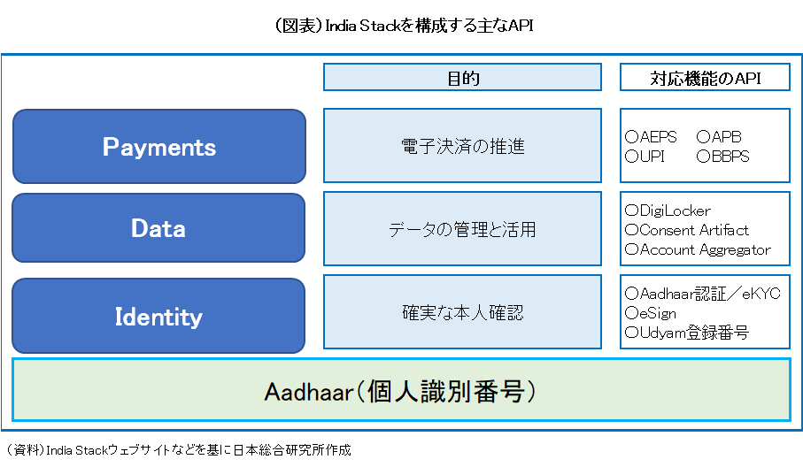
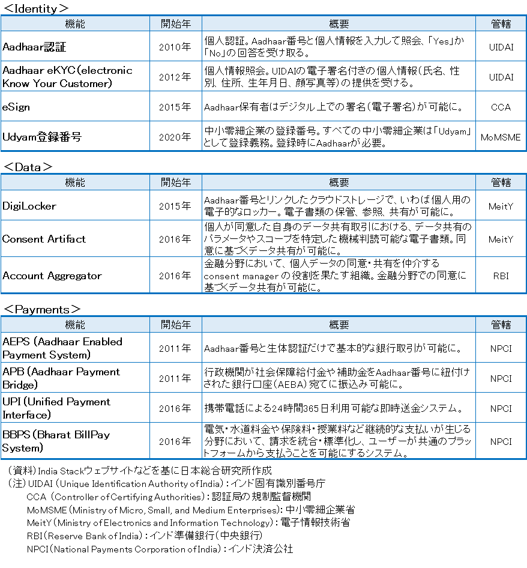
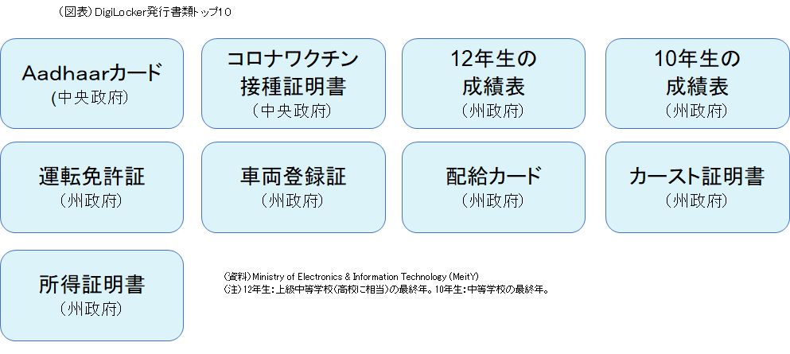
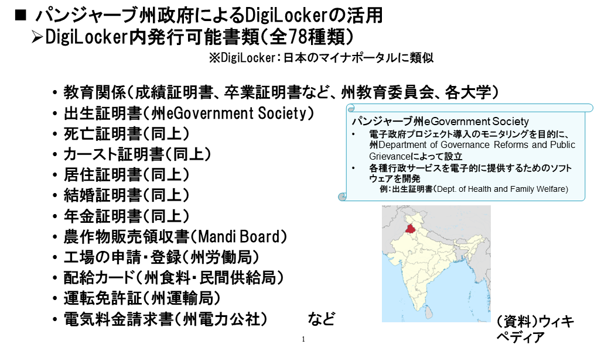
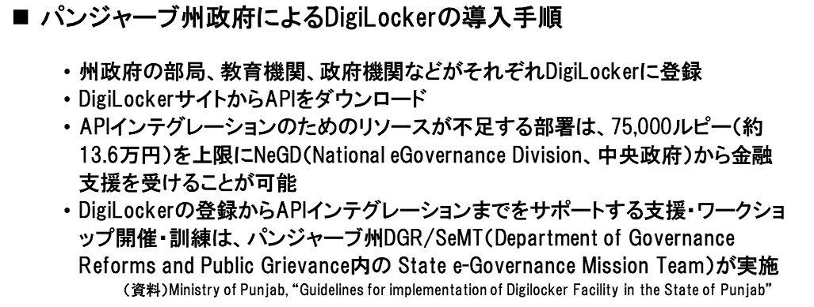

# インディアスタック

同意を巡る当事者間のやりとりに お い て、 技 術 面 で は 政府が開発・管理する「同意アーティファクト」（Consent Artifact）が取り入れられている。同意アーティファクトとは、個人が同意した自身のデータ共有取引を可能にする、機械判読可能な電子文書である。同意アーティファクトのAPIは公開され、インディアスタックの機能の一つとして提示されている。
　インド政府は経済・社会のデジタル化を実現するために様々な機能を構築してきたが、それら諸機能のオープンAPIをバーチャルに寄せ集め、インディアスタックとして提示している。目的別に

- ①確実な本人確認（identity）
- ②データの管理と活用（data）
- ③電子決済の推進（payment）

の3本柱からなり、それぞれで複数の機能が開発されている。

主なものは図表の通りである。

同意アーティファクトのAPIは、このうちの②の「データの管理と活用」に入る。
インディアスタックのそれぞれの機能は、特定の中央省庁・行政組織が、民間ボランティア組織、iSPIRT（Indian Software Product Industry Roundtable）の協力を得ながら開発している。他の中央省庁や州政府を含む行政組織、さらに民間企業は、諸機能のなかから活用したいものがあると、そのAPIを利用し、当該機能を自組織のアプリケーションと連携をすることができる。
インディアスタックが導入されたのは、インドのように巨大で多様性に富む国において、社会課題および解決策も多種多様となると予想される、それであれば、中央政府がまずはインフラを提供し、官民のさまざまな主体がそれらを活用しながら解決策を講じていくのが有効ではないか、との考えに基づく。中央政府がインフラの提供役を担うのは、各主体が独自にインフラの構築から始めていたのでは重複投資となり社会全体のコストが増すうえ、インフラを組織横断的に利用できず、その分、社会・経済への恩恵も限定的にとどまるためである。インフラはそもそも競争したり独自性を打ち出したりする性格のものではない、との認識も働いている。
もっとも、今でこそインディアスタックは体系化されているが、各機能が計画的に整然と構築されたというよりも、一つの機能が開発されると、「こんな機能もあると便利ではないか」などの考えからほかの機能がアドホックで追加されていった、というのが実態に近い。一連の機能をまとめて「インディアスタック」と呼ぶようになったのも、あとになってからである。
官民に広く開放されたインディアスタックは、多くの州でデジタル行政サービスの提供のために活用されている。州政府は活用を通じて、開発の手間とコストを省きつつ、住民の利便性向上、不正行為の削減、事務負担の軽減などを図っている。ただし、インドでは州政府に大幅な自治権が認められていることもあり、インディアスタックの諸機能を州政府が活用するか否かの判断は州政府に委ねられている。
州政府がインディアスタックを具体的にどのように活用しているかについて、クラウドストレージであるDigiLockerを例に挙げる。
DigiLockerは、アドハーに登録済みの個々人に提供される、いわば電子的なロッカーであり、そのなかで正式文書の作成、保管、授受を行うことができる。

中央政府が提供し、その利用を他の省庁や州政府に呼び掛けている。例えば、その呼びかけに応じたパンジャーブ州では、州政府の各部局、公的企業、大学、その他教育機関などがDigiLockerに対応し、現在は70種類以上の書類がDigiLockerで電子的に発行可能となっている。

それにより同州の住民は、高校の卒業証明書を大学に提出するのにDigiLocker経由で電子的に行うことができ、また、運転免許証をDigiLocker内に保管できるため運転時に現物を携行する必要がない。電気料金の請求書もDigiLocker経由で受け取り可能である。

