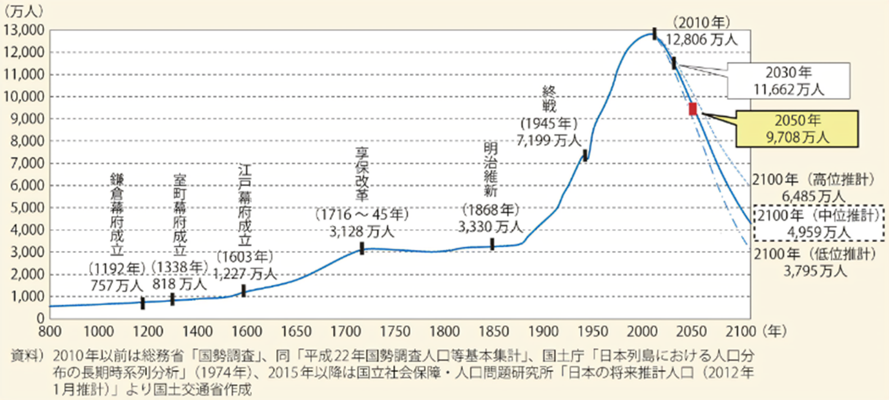
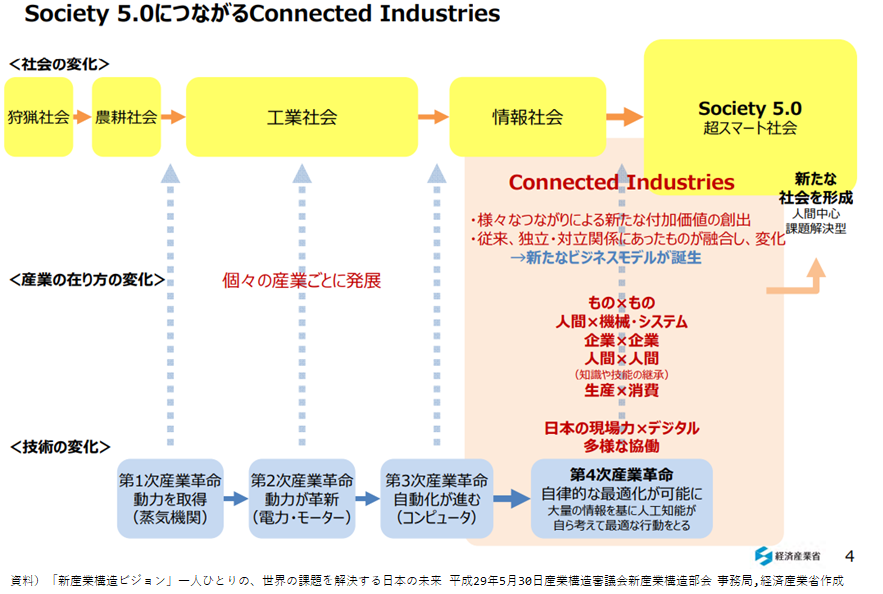
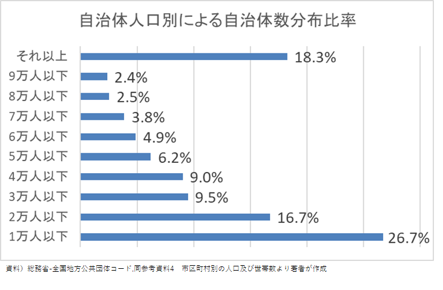
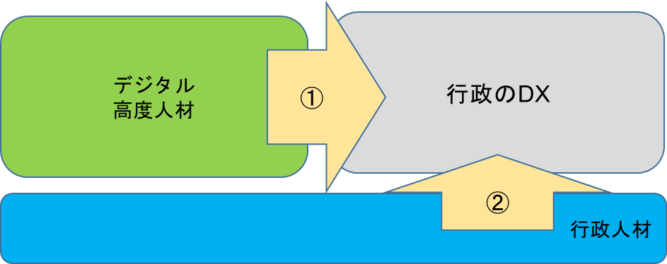

# なぜ、今なのか？
## （要約）
- <B>行政サービスにおけるデジタルの仕組は、シンプルに考えられないだろうか。
- <B>国・広域区がデジタルを基軸として進める”つながる行政サービス”は考えられないだろうか。

## （詳細）
## 日本人の人口減少状況とこの先
日本は、急激に人口が増えて曲がり角を迎えており、この先急激に人口が減る特殊な状況を抱えている。

海外の方が増えているため、分かりづらいが、ここ数年で、毎年山梨県（80万人）と同じ人口が減少している。後4、5年で1年間だけで愛媛県（100万人）と同じ人口が減る状況にある。

## デジタル化を推進する組織とそれを支える文化が揃ってきている状況
技術は進化が激しい。特にAIは、生成AI発展により現在は第4次革命を迎えている状況である。

## デジタル競争力、日本32位、分水嶺ではないか
我々は、個々人では誰もが頑張っている。安心・安全な国としての日本は諸外国に人気はあるものの、現在デジタルでは日本をお手本にする国は少なく、先進国は日本にアピールをしている状況である。

また、技術革新が進む中、各自治体の個別対応では無理が生じている状況である。

行政のDXは引き続き求められている。デジタル高度人材も行政のDXを頑張っており、行政人材もITスキルの向上やデジタル化変革、DXの勉強と頑張っている状況である。しかし、行政人材は、人材と組織自体がデジタル適応等の訓練の日は浅く時間はかかる状況である。

