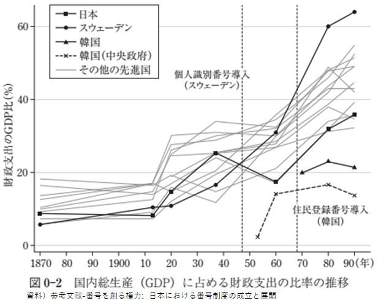
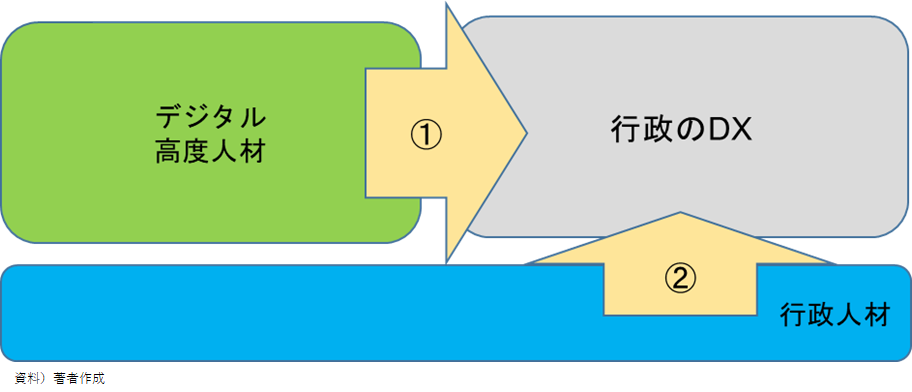

## なぜ、今なのか？

### （要約）

- <B>次世代における行政サービスのデジタルの仕組は、シンプルに考えられないだろうか。</B>
- <B>国・広域自治体にデジタルの知見やリソースを集約、そこを基軸として進める”つながる行政サービス”は考えられないだろうか。</B>

### （詳細）

#### 日本人の人口減少状況とこの先

日本は、前世紀初頭以来の急激な人口増加期を経て、今世紀に入り曲がり角を迎え、すでに急激に人口が減る特殊な状況に入っている。

ここ数年では、毎年山梨県（80万人）と同じ人口が減少している。後4、5年で1年間だけで愛媛県（100万人）と同じ人口が減る状況にある。東京都も2030年をピークに減少に転じる。
これまでのところ、女性の社会進出や海外からの働き手に支えられて人口減少のマイナス影響を辛うじて回避できてきたが、それも限界に近づきつつある。
子どもの同学年のクラス数が自分の時代に比べて明らかに減っている、募集をかけても人が集まらないなど人口減少を実感している方達は多いのではないでしょうか。

#### 技術の進化
技術の進化は、激しい。特にAIでは、生成AI発展により現在は第4次産業革命を迎えている状況である。

#### デジタル競争力は日本32位
安心・安全な国としての日本は諸外国に人気はある。しかし、デジタル化においては日本をお手本にする国は少ない。先進国は日本に自国のデジタル化をアピールしている状況である。

これまで自治体はそれぞれ個別にデジタル化に十分すぎるほど取り組んできた。しかし、技術革新が猛烈なスピードで進むなか、次世代でも個別自治体での対応を進めて行くべきだろうか。

#### 行政サービスが確立した後からのデジタルID変革の難しさ
国家レベルでは、諸外国により対応も異なる。韓国、スウェーデンでは、デジタルIDの浸透が先でその後に社会保障制度に関わる行政サービスの導入が図られた。そのため、デジタルIDに対応する行政サービスの恩恵を受けられたこともあり、自然と市民に受入られた。

しかし、日本やアメリカの場合は、先に社会保障制度に関する行政サービスが確立した。このため私達には、「従来のサービス（サイロ化したシステム or アナログ or 紙対応であろうとも）で十分享受できる。」の意識が定着した。
その後にデジタルIDを対応しようとすると「なぜ、デジタルIDを導入するのか？」の疑問が伴うことになる。このため、デジタルIDと行政サービスとの連携には何度も見直しを行った経験を持つ。

#### デジタル高度人材と行政のDX、推進する組織

人口減少と高齢化が同時進行する複雑な社会状況の下、国と地方政府の債務残高を減らし財政健全化を図るには、引き続き行政のDXを進めることが求められている。

その中で、民間から行政に合流したデジタル高度人材も、行政人材もITスキルの向上やデジタル化変革、DXの勉強と日々精進している状況である。

行政内では、人材および組織のデジタル適応に向けて取り組みが行われているものの、いまだ日は浅く、行政人材が行政DXの担い手になるまでには時間がかかる。

デジタル化を推進する組織やそれを支える"気運の醸成"は、行政の中にも定着し根付きつつある。
デジタル化を推進・浸透する組織として国はデジタル庁を立ち上げた。また、東京都はGovTech東京の組織を立ち上げている。