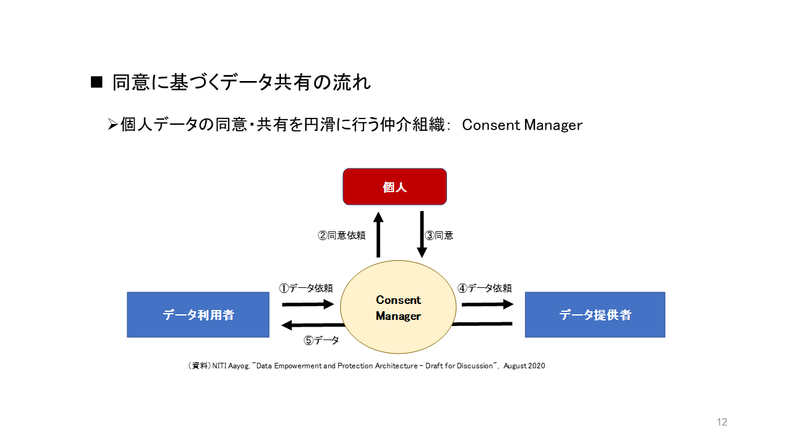

# 私達が行政サービスに求めることは何か？
## （要約）
- <B>行政サービスと個人の同意を満たすシンプルな仕組みは、ないだろうか
- <B>ここ10～15年以内で変革を行っており、今後の技術変化にも対応できるデジタル化の事例がないか
- <B>1（国）＋47（広域）の組織で進められている事例はないか
- <B>民主主義的に進めていること
- <B>他地域に展開、継続的に実施していることが望ましい

## （詳細）
## 行政サービスが確立した後からのデジタルID変革の難しさ
諸外国から見て行こう。韓国、スウェーデンでは、デジタルIDの浸透が先でその後に行政サービス導入が図られた。そのため、デジタルIDに対応すると行政サービスの恩恵を受けられたこともあり、自然と市民に受入られた。

しかし、日本やアメリカの場合は、先に行政サービスが確立された。その後でデジタルIDを対応しようとしたため、市民は、「なぜ？デジタルIDを導入するのか？従来（サイロ化したシステム or アナログ or 紙）サービスで十分である。」の意識が定着したため、導入に何度も頓挫した経験を持つ。

## 私達が行政サービスに求めたいこと
### １．行政サービスと個人の同意
デジタルを活用した個人の同意に基づく仕組みについて、提供される行政サービスは、サービスごとに個人の同意がある場合を考えてみる。すると誰に対してもその方が希望するタイミングでサービスの提供が受けられることが考えられる。

また、日本のような高度化した行政サービスの仕組みでは、一元的な単一基盤の適用は難しい。なぜならば、現状のサービスが走っているからだ。そのため、一つ一つ分野ごとの運用基盤が適合するように見受けられる。これは、分野ごとに将来的にも新規構築、拡張、拡大、廃止を行うことができることも示唆している。

### ２．ここ数十年でデジタル変革を進めており、拡張性がある
デジタルが進化した中で、私達が参考にできる事例や仕組みが国単位でないだろうか。それは、ここ数十年以内にデジタル化を推進しており、将来的にも拡張性は求められる。

### ３．約50程度の組織で変革を進めており、民主主義的である
私達も今後の人口減を想定すると、引き続き1741の行政区でデジタル化をバラバラで進めることは難しい。例えば国＋都道府県の48程度の組織で進めているところはないだろうか。また我々と同じく民主主義の国であること、できれば他の国、地域へ展開していることが望ましい。

