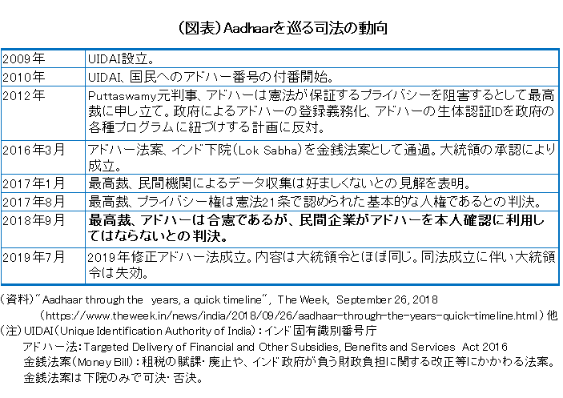
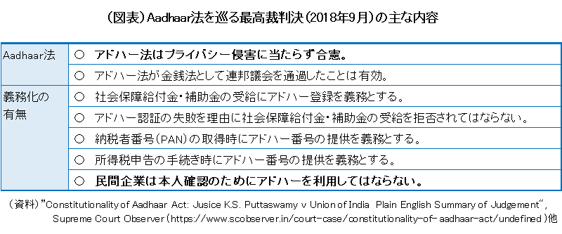
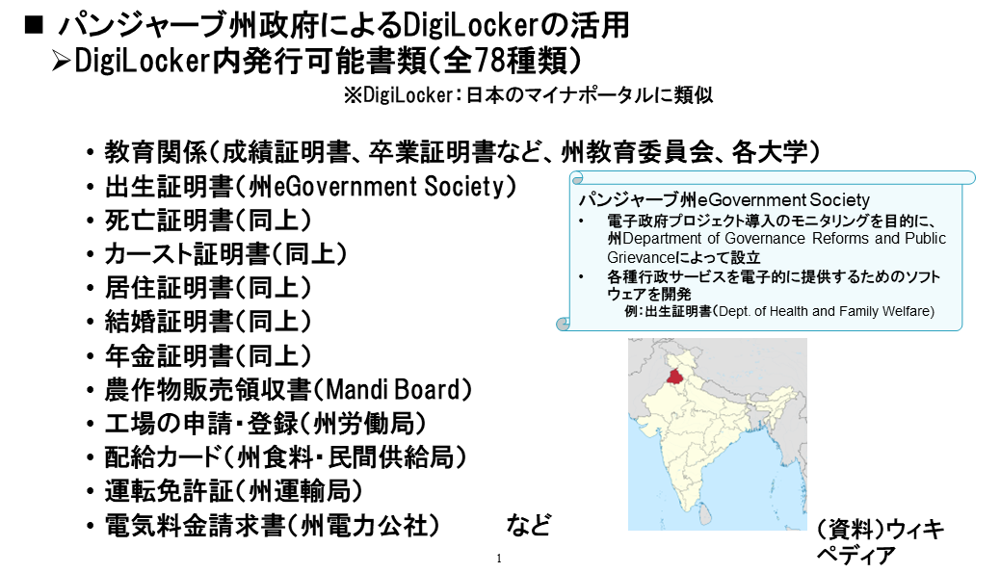
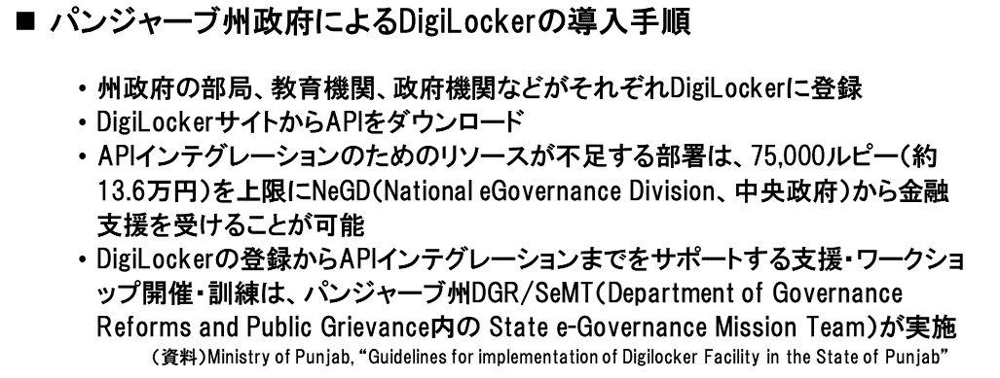

# なぜインドなのか？
## （要約）
- <B>行政サービスが確立した後からデジタルID変革を実施している
- <B>オープンAPIとして複数国が採用している
- <B>ラストワンマイルまでのサービス提供とそれを実現する行政の形がある

## （詳細）
# 行政サービスが確立した後からデジタルID変革を実施している
一方、インドの場合はどうであろうか。実は、インドも日本やアメリカと同様、行政サービスが確立した後でのデジタルID変革パターンに該当する。
インドの場合、計画よりも市民がデジタルサービス享受を受けれるデジタルID変革推進ありきを優先して導入を行ってきた。個人情報取り扱いについては、何度も裁判での議論を尽くしてきた。この議論は7年以上の歳月を要している。

議論が尽くされた結果の判決概要は以下になる。民主主義として、国・国民がどうあるべきかがお分かりになるだろう。

特筆すべきは、上位目標を洗練し個人データは本人の同意のもと、プライバシーに配慮しつつ安全に第三者と共有することに努めたコンセントマネージャの仕組みである。

> 岩崎さんよりコンセントマネージャ図と資料を引用。確認

## オープンAPIとして複数国が採用している

先進国としては、エストニア、シンガポールの名前があがる。しかし、これらの国々は、人口約133万人、564万人である。地理上等の理由により、仕組みに地域特化が行われているため、汎用性を有しているとはいいがたい。
インドの場合は、オープンソースでの提供での設計が意識されており、複数メンバーでのレビューを受けて構築されてきた形跡がある。
また、最近は、インディアスタックからDPI（デジタル・パブリック・インフラストラクチャ）へ呼び名を変えており、国連標準化を意識しているのではないかと推察される。
2023年9月末現在において、インド含め18か国にDPIを推進中である。
トーゴ、ギニア、シエラレオネ、ブルキナファソ、ニジェール、モロッコ、エチオピア、マダガスカル、フィリピン、スリランカ、 
アルメニア、スリナム、アンティグア、バルバドス、トリニダード・トバゴ、パプアニューギニア、モーリシャス
※mosip、businessline 情報

## ラストワンマイルまでのサービス提供と行政の形
インドの場合は、国＋州を合わせた36の行政区で約14億人の行政サービスをカバーしている。
州単位で提供されている行政サービスの一例を以下に示す。

そして、この導入手順・導入支援・誰が実施しているかはシンプルであることが分かるだろう。

利用する国民の視点に立ち、まさに行政サービスはどうあるべきか当事者目線で考えられているのである。

アドハーは、登録間違いもまだまだ散見される。しかし、訂正の積み重ねによりあるべき行政を目指していることが見受けられる。