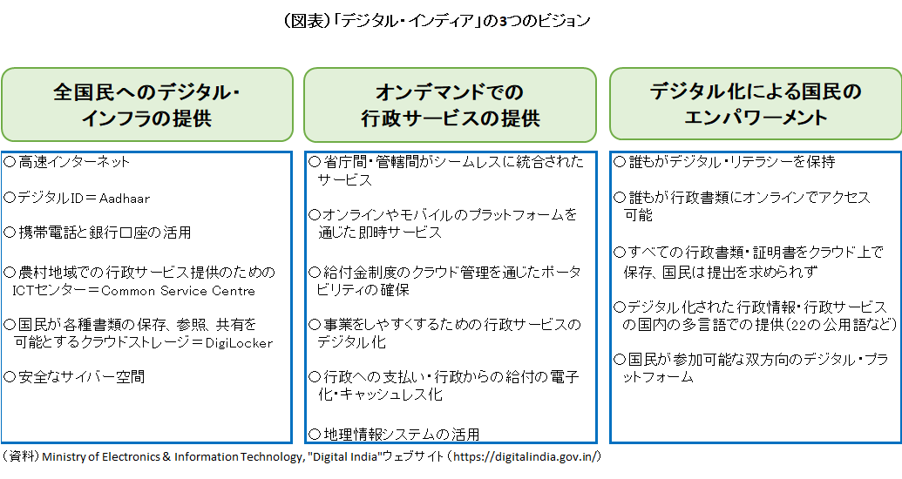

## なぜインドなのか？

### （要約）

- <B>行政サービスが確立した後からデジタルID変革を実施している</B>
- <B>オープンAPIとして複数国が採用している</B>
- <B>ラストワンマイルまでのサービス提供とそれを実現する行政の形がある</B>

### （詳細）

#### 概要

日本が人口減少のもとでも行政サービスの量と質を維持するためにデジタル化は不可欠である。行政サービスのデジタル化に取り組む国は多いものの、日本が参考にできる国はさほど多くはない。まず、政権の鶴の一声で物事を決めることのできる権威主義国家は対象から外す必要がある。また、一国全体で東京都の人口に満たない小国も参考になりづらい。日本程度の人口規模になると意思決定や行動が必然的に遅くなりがちで、小回りのきく人口小国のようには動けないためである。
 さらに、個人識別番号が古くから導入され定着している国も、日本とは環境が大きく異なる。行政サービスのデジタル化においては、オンライン上で住民の確実な本人確認を実施できることが必須であり、そのために個人識別番号が重要な役割を果たす。ところが、前述の通り、社会保障制度の整備がすでに済み、かつプライバシー意識が高まった後に個人識別番号を導入すると、国民としてもメリットを実感しづらい一方でデメリットを感じやすく、普及のハードルが上がることになる。日本でマイナンバーカードの普及が遅れたのも、一つにはこうした事情が影響している。
 このように絞っていくと浮かび上がるのがインドである。インドは民主主義国家で人口大国でもあるうえ、個人識別番号の登録を開始したのは2010年と、社会保障制度が確立されプライバシー保護意識も高まった後である。しかも、インドの取り組みを子細にみると、行政サービスのデジタル化を効率的に進め、コストを抑制しつつ効果を最大限引き出すための工夫や、デジタル技術の今後の進化にも対応できるための工夫がなされている。プライバシーの保護と個人データの活用をどう両立させるか、そもそもデジタルリテラシーどころかリテラシー（識字率）が8割にとどまる14億の国民にいかにリーチするか、といった難問に知恵を絞った痕跡が随所にみられる。インド版マイナンバーであるアドハー（Aadhaar、アードハーやアーダールとも発音）を巡る違憲訴訟という逆風にさらされ、さまざまな軌道修正を行いつつも着実に取り組みを進めてきた点や、そうして確立したデジタル行政サービス提供のためのインフラであるインディアスタック（India Stack）を海外展開している点も特筆に値する。その意味で、消去法どころか、率先して学ぶべき国としてインドが挙げられる。

インドはいまや中国を抜いて世界一の人口大国となり、米中対立などの影響で対中ビジネスの自由度が低下するなか、日本でも市場の開拓先や投資先としてインドへの注目度が高まっている。その一方で、先進国である日本が新興国のインドから学ぼうという意識は総じて低いのが実情である。しかし、インドのような新興国はリープフログ、つまり発展の途中段階を飛ばしていきなり最新のデジタル技術・サービスを導入するなどして、デジタル先進国に躍り出ることが可能である。デジタルの領域に限れば”デジタル競争力32位”の日本にとって、インドのデジタル行政サービス普及に向けた制度設計や背景にある考え方などは、多くの点で示唆に富む。
