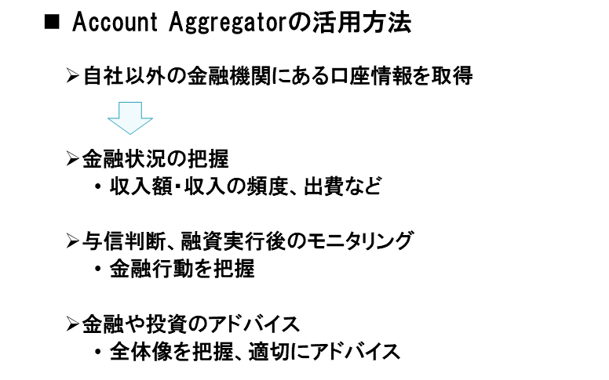
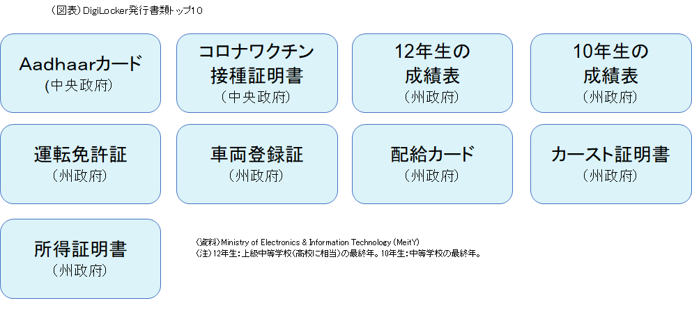

## なぜインドなのか？

### （要約）

- <B>行政サービスが確立した後からデジタルID変革を実施している</B>
- <B>オープンAPIとして複数国が採用している</B>
- <B>ラストワンマイルまでのサービス提供とそれを実現する行政の形がある</B>

### （詳細）

#### 概要

日本が人口減少のもとでも行政サービスの量と質を維持するためにデジタル化は不可欠である。行政サービスのデジタル化に取り組む国は多いものの、日本が参考にできる国はさほど多くはない。まず、政権の鶴の一声で物事を決めることのできる権威主義国家は対象から外す必要がある。また、一国全体で東京都の人口に満たない小国も参考になりづらい。日本程度の人口規模になると意思決定や行動が必然的に遅くなりがちで、小回りのきく人口小国のようには動けないためである。
 さらに、個人識別番号が古くから導入され定着している国も、日本とは環境が大きく異なる。行政サービスのデジタル化においては、オンライン上で住民の確実な本人確認を実施できることが必須であり、そのために個人識別番号が重要な役割を果たす。ところが、前述の通り、社会保障制度の整備がすでに済み、かつプライバシー意識が高まった後に個人識別番号を導入すると、国民としてもメリットを実感しづらい一方でデメリットを感じやすく、普及のハードルが上がることになる。日本でマイナンバーカードの普及が遅れたのも、一つにはこうした事情が影響している。
 このように絞っていくと浮かび上がるのがインドである。インドは民主主義国家で人口大国でもあるうえ、個人識別番号の登録を開始したのは2010年と、社会保障制度が確立されプライバシー保護意識も高まった後である。しかも、インドの取り組みを子細にみると、行政サービスのデジタル化を効率的に進め、コストを抑制しつつ効果を最大限引き出すための工夫や、デジタル技術の今後の進化にも対応できるための工夫がなされている。プライバシーの保護と個人データの活用をどう両立させるか、そもそもデジタルリテラシーどころかリテラシー（識字率）が8割にとどまる14億の国民にいかにリーチするか、といった難問に知恵を絞った痕跡が随所にみられる。インド版マイナンバーであるアドハー（Aadhaar、アードハーやアーダールとも発音）を巡る違憲訴訟という逆風にさらされ、さまざまな軌道修正を行いつつも着実に取り組みを進めてきた点や、そうして確立したデジタル行政サービス提供のためのインフラであるインディアスタック（India Stack）を海外展開している点も特筆に値する。その意味で、消去法どころか、率先して学ぶべき国としてインドが挙げられる。

インドはいまや中国を抜いて世界一の人口大国となり、米中対立などの影響で対中ビジネスの自由度が低下するなか、日本でも市場の開拓先や投資先としてインドへの注目度が高まっている。その一方で、先進国である日本が新興国のインドから学ぼうという意識は総じて低いのが実情である。しかし、インドのような新興国はリープフログ、つまり発展の途中段階を飛ばしていきなり最新のデジタル技術・サービスを導入するなどして、デジタル先進国に躍り出ることが可能である。デジタルの領域に限れば”デジタル競争力32位”の日本にとって、インドのデジタル行政サービス普及に向けた制度設計や背景にある考え方などは、多くの点で示唆に富む。

#### 個人データの活用

インドにおける個人識別番号、アドハーは全住民を対象とする12桁の固有番号である。

それ以前に住民誰もが保有可能、かつ信頼性の高い本人確認の手段が存在しなかったこともあり、取得は任意であるにもかかわらず、いまや人口の9割以上がアドハーに登録済みである。
 
アドハーは2010年の導入当初から多方面で批判を受け、2012年には憲法が保証するプライバシーを阻害するとして最高裁への申し立てが行われた。そこから最高裁判決が下りる2018年まで、アドハーのような個人データをどのように扱うべきかについて、司法を含め多様な場で議論が繰り広げられた。

最高裁判決では、アドハーがプライバシーの侵害に当たらず合憲であると認められる一方で、民間企業が本人確認のためにアドハーを用いてはならないとされた。

そこで、政府主導でアドハー法が改正され（2019年）、政府の認可を得られた組織であれば、本人の同意のもとでアドハーによる本人確認を可能とした。

現在、金融機関（保険、証券、ノンバンクを含む）および通信事業会社が政府の認可を受け、本人確認にアドハーを積極的に利用している。2023年には政府が、アドハーによる本人確認をより広範な業種の民間企業に認める案を打ち出している。
 
一連の経緯からも明らかな通り、インド政府は、アドハーを含め個人データは本人の利益になるような方法で積極活用すべき、との立場を採っている。最高裁判決後、アドハー法を改正してまで民間企業の利用を可能にしたのは、アドハーで容易に本人確認できれば、個人にとって金融サービスへのアクセスやSIMカードの購入も容易になるはず、との判断に基づく。この背景には、インドは経済的に貧しいながら、人口大国として個人情報の面では豊かである、そこで、個人情報をデータベース化して個人データとし、それを活用しながら経済的にも豊かになろう、という考えがある。

 
ただし、個人データの利用を野放図に認めると、特定企業による独占といった弊害が生じ、個人の利益に資するという目的に反することになる。そこで、本人確認にアドハーを用いる場合のみならず、アドハー以外の個人データを取得し利用する場合にも、必ず本人の同意を必要とした。そして、誰もがルールに基づき個人データを共有できることで、逆に誰も独占できない状況を作り出そうとしている。

> 同意（consent）の絵図が欲しい。

#### 同意に基づく個人データ共有

インド政府が構築した「同意に基づく個人データの共有」とは、ある組織が保有する自身に関するデータについて、①どれを、②誰に、③どのような目的で、④どの期間、共有するかの決定権は個人にあり、共有の見返りとして豊かさや利便性の向上につながるサービスを受けることができる、というものである。実際には、個人が自分で自らデータ共有に乗り出すというよりも、何らかのサービスを申し込んだり受けたりする際に、サービスの提供者が他の組織内にあるその人のデータを使いたいと考え、それにその人が同意する形をとる。
このコンセプトに基づく個人データ共有の流れが図表２である。

個人データの同意・共有を円滑に行う仲介組織として、「コンセントマネージャー」（同意管理者）が設置されている。データを利用したい組織（＝データ利用者）は、そのデータを保有する組織（＝データ提供者）にではなくコンセントマネージャーにその旨を依頼する。依頼を受けたコンセントマネージャーは、個人に対してデータ共有に同意するか否かを尋ね、同意が得られると、データ提供者にデータを求めそれをデータ利用者に渡す。
コンセントマネージャーが置かれることで、データ利用者は一連の作業をワンストップで電子的に行うことができ、自ら個人の同意を取り付けたり、データを取り寄せたりする必要がなく、したがって、そのためのシステムを構築・維持管理する必要がない。
 
コンセントマネージャーを仲介役とした「同意に基づく個人データ共有」は、金融やヘルスケアをはじめさまざまな分野に運用することが想定されている。例えば金融分野で共有されるのは個人の金融資産・負債に関するデータであり、融資できるか、適切な資産運用アドバイスを行えるかといった、資金面にかかわる判断力の向上などを共有の目的とする。それに対して、ヘルスケア分野で共有されるのは個人の健康・医療に関するデータであり、医療の質の改善や医療業務の効率化を共有目的とする。このように、分野ごとにデータ共有の内容や目的が異なる点を踏まえ、基本的な枠組みは維持しつつ、分野ごとに独自の仕組みが構築されることになる。
 
この点が、世界的に有名なエストストニアのデータ共有の仕組みと大きく異なる。エストニアでは、省庁、行政機関、医療機関などが有する個人データの共有が単一の基盤、「X-Road」 を 通 じ て 行 わ れ る（ 図 表３）。

しかし、単一の基盤は人口130万人のエストニアでは機能しても、多様性が著しい人口14億人のインドでは機能しづらいとの判断から、インド政府はこれとは異なる独自の仕組みを採用した。
この仕組みの運用第１号として選定されたのが金融分野であり、すでに実装されている。

そして、コンセントマネージャーの役割を果たす組織として、アカウントアグリゲーター（Account Aggregator＜AA＞、直訳すると「取引のとりまとめ者」）が取り入れられた。AAはデータを提供者から利用者に流すだけであり、データの蓄積はおろか、自社での閲覧や加工は一切禁じられている。この点は封書郵便の配達に類似している。郵便ポストに投函された封書が郵便局に一時的に集められた後、宛先に配達されるのと同様に、データも提供者からAAのサーバを経由してそのまま利用者に送られる。郵便職員が封書を開封して中身を読めないのと同様に、流れるデータは暗号化されており、AAは中身をみることができない。
封書郵便と異なるのは、封書の受け取り手はそれを好きなだけ保管出来るのに対して、データ利用者は事前に定められた期間が過ぎると、データを廃棄しなければならない点である。利用者がデータを蓄積したり、当初の目的以外で利用したりすることは禁じられている。

#### インディアスタック

同意を巡る当事者間のやりとりに お い て、 技 術 面 で は 政府が開発・管理する「同意アーティファクト」（Consent Artifact）が取り入れられている。同意アーティファクトとは、個人が同意した自身のデータ共有取引を可能にする、機械判読可能な電子文書である。同意アーティファクトのAPIは公開され、インディアスタックの機能の一つとして提示されている。
　インド政府は経済・社会のデジタル化を実現するために様々な機能を構築してきたが、それら諸機能のオープンAPIをバーチャルに寄せ集め、インディアスタックとして提示している。目的別に
- ①確実な本人確認（identity）
- ②データの管理と活用（data）
- ③電子決済の推進（payment）

の3本柱からなり、それぞれで複数の機能が開発されている。

主なものは図表５の通りである。

同意アーティファクトのAPIは、このうちの②の「データの管理と活用」に入る。
インディアスタックのそれぞれの機能は、特定の中央省庁・行政組織が、民間ボランティア組織、iSPIRT（Indian Software Product Industry Roundtable）の協力を得ながら開発している。他の中央省庁や州政府を含む行政組織、さらに民間企業は、諸機能のなかから活用したいものがあると、そのAPIを利用し、当該機能を自組織のアプリケーションと連携をすることができる。
インディアスタックが導入されたのは、インドのように巨大で多様性に富む国において、社会課題および解決策も多種多様となると予想される、それであれば、中央政府がまずはインフラを提供し、官民のさまざまな主体がそれらを活用しながら解決策を講じていくのが有効ではないか、との考えに基づく。中央政府がインフラの提供役を担うのは、各主体が独自にインフラの構築から始めていたのでは重複投資となり社会全体のコストが増すうえ、インフラを組織横断的に利用できず、その分、社会・経済への恩恵も限定的にとどまるためである。インフラはそもそも競争したり独自性を打ち出したりする性格のものではない、との認識も働いている。
もっとも、今でこそインディアスタックは体系化されているが、各機能が計画的に整然と構築されたというよりも、一つの機能が開発されると、「こんな機能もあると便利ではないか」などの考えからほかの機能がアドホックで追加されていった、というのが実態に近い。一連の機能をまとめて「インディアスタック」と呼ぶようになったのも、あとになってからである。
官民に広く開放されたインディアスタックは、多くの州でデジタル行政サービスの提供のために活用されている。州政府は活用を通じて、開発の手間とコストを省きつつ、住民の利便性向上、不正行為の削減、事務負担の軽減などを図っている。ただし、インドでは州政府に大幅な自治権が認められていることもあり、インディアスタックの諸機能を州政府が活用するか否かの判断は州政府に委ねられている。
州政府がインディアスタックを具体的にどのように活用しているかについて、クラウドストレージであるDigiLockerを例に挙げる。
DigiLockerは、アドハーに登録済みの個々人に提供される、いわば電子的なロッカーであり、そのなかで正式文書の作成、保管、授受を行うことができる。

中央政府が提供し、その利用を他の省庁や州政府に呼び掛けている。例えば、その呼びかけに応じたパンジャーブ州では、州政府の各部局、公的企業、大学、その他教育機関などがDigiLockerに対応し、現在は70種類以上の書類がDigiLockerで電子的に発行可能となっている。

それにより同州の住民は、高校の卒業証明書を大学に提出するのにDigiLocker経由で電子的に行うことができ、また、運転免許証をDigiLocker内に保管できるため運転時に現物を携行する必要がない。電気料金の請求書もDigiLocker経由で受け取り可能である。

#### 海外展開

インディアスタックの諸機能を一通り構築したインド政府は、現在、これらの海外展開に乗り出している。それによって、インド主導のもと、他の途上国・新興国との間で相互運用性の確立されたデジタル経済圏を確立し、それをテコに発言権を強めるとともに、デジタルの領域における先進国依存から脱却し独立性を強めたいとの狙いがあると推測される。
海外展開は、主に以下の三つのルートを通じて行われている。
##### MOSIP（Modular Open Source Identity Platform）の提供
第1に、MOSIP（Modular Open Source Identity Platform）の提供である。MOSIPとは、デジタルIDシステムの円滑な導入を可能にするプラットフォームである。世界の途上国・新興国のなかには、確実な本人確認手段がなく、導入しようにも技術力や資金面での制約から実現できない国が少なからず存在する。そうした国の政府に対して、国際情報技術大学院ベンガルール校（IIITB）が中心となって、インドにおけるAadhaarの導入・普及の経験を活かす形で2018年に開発されたのがMOSIPである。現在、MOSIPのプログラムには10カ国が参加している。

MOSIPのプログラムでは、各国政府に対しデジタルIDのインフラを構築するための技術をオープンソース・ソフトウェアの形で提供するほか、導入のための技術支援や、円滑な運営のための現地職員への訓練を実施している。現在、技術提供は無料、導入支援・訓練は有料で行われている。MOSIPの特徴としては、①モジュラー型の設計となっており、各国政府は諸機能のなかから自国の事情に応じてさまざまに組み合わせて導入することが可能、②オープンソース、オープンスタンダードにより、透明性、柔軟性、相互運用性の面で優れているうえ、導入コストが相対的に安価、③これらの点により、特定のベンダーに依存しないベンダーニュートラルを実現可能、などが挙げられる。
##### 「デジタル公共インフラ（Digital Public Infrastructure、DPI）」としてのインディアスタックの共有
　第2に、「デジタル公共インフラ（Digital Public Infrastructure、DPI）」としてのインディアスタックの共有である。DPIはさまざまに定義されているが、簡単にいえば、国民生活や経済活動がデジタル技術の恩恵を享受できるように整備された、オンライン上誰もが利用可能なインフラである。デジタル領域でのインフラとして即座に連想するのはインターネットや通信ネットワークであろうが、これらは技術基盤としてDPIとは区別される。技術基盤のうえにDPIが成り立つが、技術基盤にはニュートラルな色彩が濃いのに対して、DPIには、それによって社会・経済を改善したいという明確な期待が込められている。
インド政府はインディアスタックをインドにおけるDPIと位置付け、DPIによってインド国民が享受した恩恵を途上国・新興国にも広げたいとして、その輸出を積極化させている。
2023年のG20議長国であったインドは、デジタル経済大臣会合（2023年8月）やG20首脳会合（同年9月）でDPIの重要性を訴えた。また、G20デジタル経済ワーキンググループのサイドイベントとして「グローバルDPIサミット」を開催し（同年6月）、その場でインディアスタックの共有に向けて4カ国とMOUを締結した。その後、MOU締結国は増え、現在は8カ国となっている（図表８）。DPIとしてのインディアスタックの諸機能のなかでも途上国・新興国がとりわけ強い関心を寄せているといわれるのが、DigiLocker（クラウドストレージ）および後述のUPI（携帯電話を用いた24時間365日即時送金）である。

##### UPIのグローバル化 

第3に、UPIのグローバル化である。UPIは世界的にみても先進的な、利便性の高い決済プラットフォームである。QRコードと組み合わせると屋台などリアルな場での支払いにも容易に利用できること、インド政府の指導により利用者側、店舗側とも手数料が基本的に無料となっていること、などにより、2016年にインドで導入されて以降、利用が爆発的に増加した。インド国内においてリテール電子決済件数全体に占めるUPIの割合はいまや74％に達する（2022年度）。
2点目のDPIのスキームでは、インディアスタックの一つの機能としてUPIを他国に導入するというものであるが、この3点目ではそれとは別に、UPIの他国での利用、および他国の即時送金システムとのリンクに取り組んでいる。前者の、UPIの他国利用については、ブータン（2021年7月）を皮切りに、現在はシンガポール、UAE、モーリシャス、ネパールでも可能となっている。例えば、インドからブータンへの渡航者は、ブータンの店舗にあるQRコードに携帯電話をかざして支払いができる。後者の他国の即時送金システムとのリンクについては、2023年2月にシンガポールのPayNowとの間で実現した。インドからシンガポールの渡航者ばかりでなく、シンガポールからインドへの渡航者も、店舗でのQRコード決済が可能になった。こうしたリンクが拡大すると、越境決済の姿も大きく変わることになろう。

##### Aadhaar利用状況と国民のフィードバック

アドハーの登録間違いもまだ散見される。調査結果2からは、2010年から9年間取り組んできた状況が見られる。

