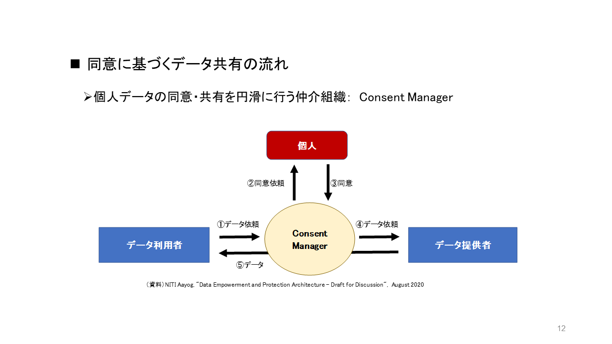
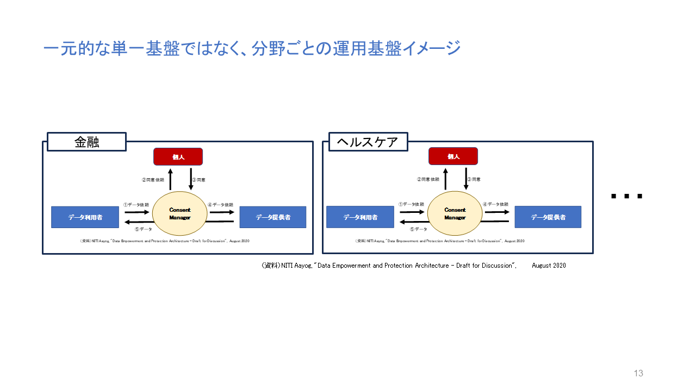

## 行政サービスが確立した後からのデジタルID変革の難しさ
諸外国から見て行こう。韓国、スウェーデンでは、デジタルIDの浸透が先でその後に行政サービス導入が図られた。そのため、デジタルIDに対応すると行政サービスの恩恵を受けられたこともあり、自然と市民に受入られた。

しかし、日本やアメリカの場合は、先に行政サービスが確立された。その後でデジタルIDを対応しようとしたため、市民は、「なぜ？デジタルIDを導入するのか？従来（サイロ化したシステム or アナログ or 紙）サービスで十分である。」の意識が定着したため、導入に何度も頓挫した経験を持つ。

## 私達が行政サービスに求めたいこと
### １．行政サービスと個人の同意
デジタルを活用した個人の同意に基づく仕組みについて、提供される行政サービスは、サービスごとに個人の同意がある場合を考えてみる。すると誰に対してもその方が希望するタイミングでサービスの提供が受けられることが考えられる。

また、日本のような高度化した行政サービスの仕組みでは、一元的な単一基盤の適用は難しい。なぜならば、現状のサービスが走っているからだ。そのため、一つ一つ分野ごとの運用基盤が適合するように見受けられる。これは、分野ごとに将来的にも新規構築、拡張、拡大、廃止を行うことができることも示唆している。

### ２．ここ数十年でデジタル変革を進めており、拡張性がある
デジタルが進化した中で、私達が参考にできる事例や仕組みが国単位でないだろうか。それは、ここ数十年以内にデジタル化を推進しており、将来的にも拡張性は求められる。

### ３．約50程度の組織で変革を進めており、民主主義的である
私達も今後の人口減を想定すると、引き続き1741の行政区でデジタル化をバラバラで進めることは難しい。例えば国＋都道府県の48程度の組織で進めているところはないだろうか。また我々と同じく民主主義の国であること、できれば他の国、地域へ展開していることが望ましい。

## （まとめ）
- <B>どこかに行政サービスと個人の同意を満たす仕組み（シンプル）は、ないだろうか
- <B>ここ10～15年以内で最新技術にフィットした（今後もし続けられる）デジタル化の事例がないか
- <B>１＋４７程度の組織で進められないか
- <B>民主主義的に進めていることは大前提
- <B>他地域に展開、継続的に実施していること
 
 
# なぜインドなのか？

一方、インドの場合はどうであろうか。実は、インドも日本やアメリカと同様、行政サービスが確立した後でのデジタルID変革パターンに該当する。
インドの場合、計画よりも市民がデジタルサービス享受を受けれるデジタルID変革推進ありきを優先して導入を行ってきた。個人情報取り扱いについては、何度も裁判での議論を尽くしてきた。この議論は7年以上の歳月を要している。

議論が尽くされた結果の判決概要は以下になる。民主主義として、国・国民がどうあるべきかがお分かりになるだろう。

特筆すべきは、上位目標を洗練し個人データは本人の同意のもと、プライバシーに配慮しつつ安全に第三者と共有することに努めたコンセントマネージャの仕組みである。

> 岩崎さんよりコンセントマネージャ図と資料を引用。確認

## オープンAPIとして複数国が採用している

先進国としては、エストニア、シンガポールの名前があがる。しかし、これらの国々は、人口約133万人、564万人である。地理上等の理由により、仕組みに地域特化が行われているため、汎用性を有しているとはいいがたい。
インドの場合は、オープンソースでの提供での設計が意識されており、複数メンバーでのレビューを受けて構築されてきた形跡がある。
また、最近は、インディアスタックからDPI（デジタル・パブリック・インフラストラクチャ）へ呼び名を変えており、国連標準化を意識しているのではないかと推察される。
2023年9月末現在において、インド含め18か国にDPIを推進中である。
トーゴ、ギニア、シエラレオネ、ブルキナファソ、ニジェール、モロッコ、エチオピア、マダガスカル、フィリピン、スリランカ、 
アルメニア、スリナム、アンティグア、バルバドス、トリニダード・トバゴ、パプアニューギニア、モーリシャス
※mosip、businessline 情報

## ラストワンマイルまでのサービス提供と行政形態
インドの場合は、国＋州を合わせた36の行政区で約14億人の行政サービスをカバーしている。
州単位で提供されている行政サービスの一例を以下に示す。

そして、この導入手順・導入支援・誰が実施しているかはシンプルであることが分かるだろう。

利用する国民の視点に立ち、まさに行政サービスはどうあるべきか当事者目線で考えられているのである。

アドハーは、登録間違いもまだまだ散見される。しかし、訂正の積み重ねによりあるべき行政を目指していることが見受けられる。