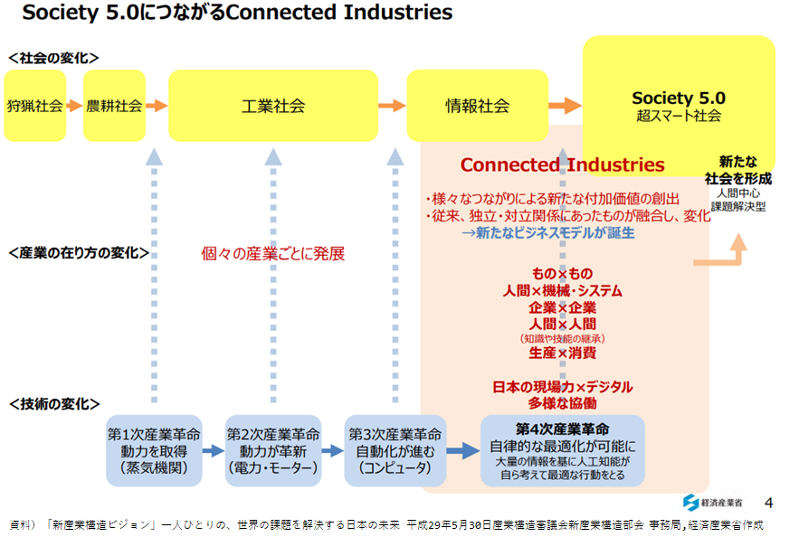

# なぜ、今なのか？
## 日本人の人口減少状況とこの先

ここ数年で、毎年、山梨県（80万人）と同じ人口が減少している。後4,5年で1年間で愛媛県（100万人）と同じ人口が減る状況である。

## デジタル競争力、日本32位、分水嶺

## デジタル化を推進する組織とそれを支える文化が揃ってきている状況
技術は進化が激しい。AIは、生成AI登場により第4次革命を迎えている状況である。

技術革新が進む中、
各自治体の個別対応はムリがある。

①と②では、どちらが早いだろうか
※②は人材、組織が訓練されていないため、時間がかかる。

- <B>行政サービスにおけるデジタルの仕組は、シンプルに考えられないだろうか。
- <B>国・広域区がデジタルを基軸として進める”つながる行政サービス”は考えられないだろうか。