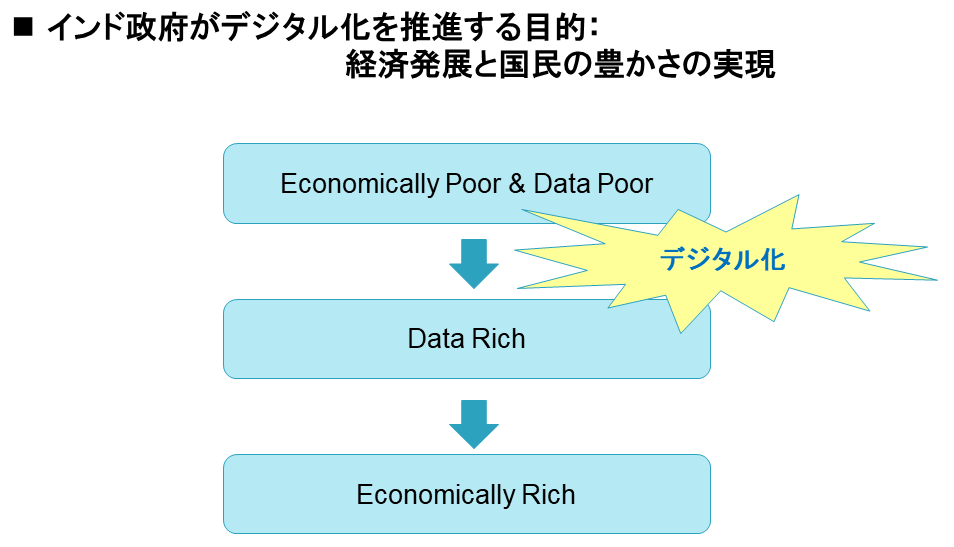

## インドにおける個人データ

インドにおける個人識別番号、アドハーは全住民を対象とする12桁の固有番号である。

それ以前に住民誰もが保有可能、かつ信頼性の高い本人確認の手段が存在しなかったこともあり、取得は任意であるにもかかわらず、いまや人口の9割以上がアドハーに登録済みである。
 
アドハーは2010年の導入当初から多方面で批判を受け、2012年には憲法が保証するプライバシーを阻害するとして最高裁への申し立てが行われた。そこから最高裁判決が下りる2018年まで、アドハーのような個人データをどのように扱うべきかについて、司法を含め多様な場で議論が繰り広げられた。

最高裁判決では、アドハーがプライバシーの侵害に当たらず合憲であると認められる一方で、民間企業が本人確認のためにアドハーを用いてはならないとされた。

そこで、政府主導でアドハー法が改正され（2019年）、政府の認可を得られた組織であれば、本人の同意のもとでアドハーによる本人確認を可能とした。

現在、金融機関（保険、証券、ノンバンクを含む）および通信事業会社が政府の認可を受け、本人確認にアドハーを積極的に利用している。2023年には政府が、アドハーによる本人確認をより広範な業種の民間企業に認める案を打ち出している。
 
一連の経緯からも明らかな通り、インド政府は、アドハーを含め個人データは本人の利益になるような方法で積極活用すべき、との立場を採っている。最高裁判決後、アドハー法を改正してまで民間企業の利用を可能にしたのは、アドハーで容易に本人確認できれば、個人にとって金融サービスへのアクセスやSIMカードの購入も容易になるはず、との判断に基づく。この背景には、インドは経済的に貧しいながら、人口大国として個人情報の面では豊かである、そこで、個人情報をデータベース化して個人データとし、それを活用しながら経済的にも豊かになろう、という考えがある。

 
ただし、個人データの利用を野放図に認めると、特定企業による独占といった弊害が生じ、個人の利益に資するという目的に反することになる。そこで、本人確認にアドハーを用いる場合のみならず、アドハー以外の個人データを取得し利用する場合にも、必ず本人の同意を必要とした。そして、誰もがルールに基づき個人データを共有できることで、逆に誰も独占できない状況を作り出そうとしている。

> 同意（consent）の絵図が欲しい。

