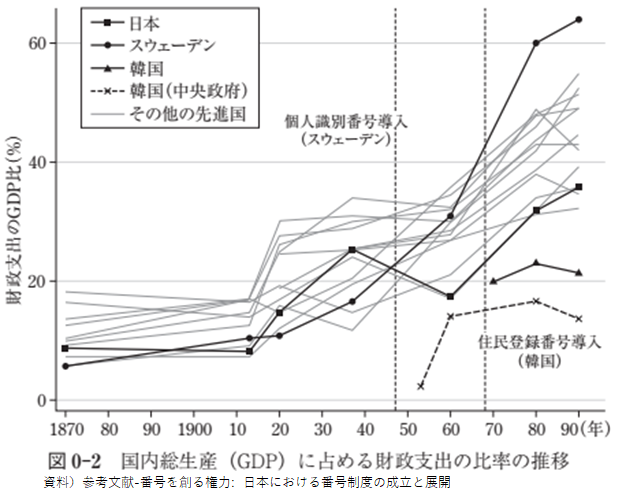

# 行政サービスが確立した後からのデジタルID変革の難しさ
※この発信は自主勉強会を収録したものである。

## （要約）

## （詳細）
### 行政サービスが確立した後からのデジタルID変革は難しい
国家レベルでは、諸外国から見て行こう。韓国、スウェーデンでは、デジタルIDの浸透が先でその後に行政サービス導入が図られた。そのため、デジタルIDに対応すると行政サービスの恩恵を受けられたこともあり、自然と市民に受入られた。

しかし、日本やアメリカの場合は、先に行政サービスが確立された。その後でデジタルIDを対応しようとしたため、市民は、「なぜ？デジタルIDを導入するのか？従来（サイロ化したシステム or アナログ or 紙）サービスで十分である。」の意識が定着したため、導入に何度も頓挫した経験を持つ。

