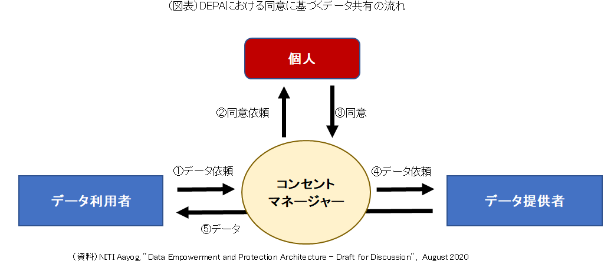
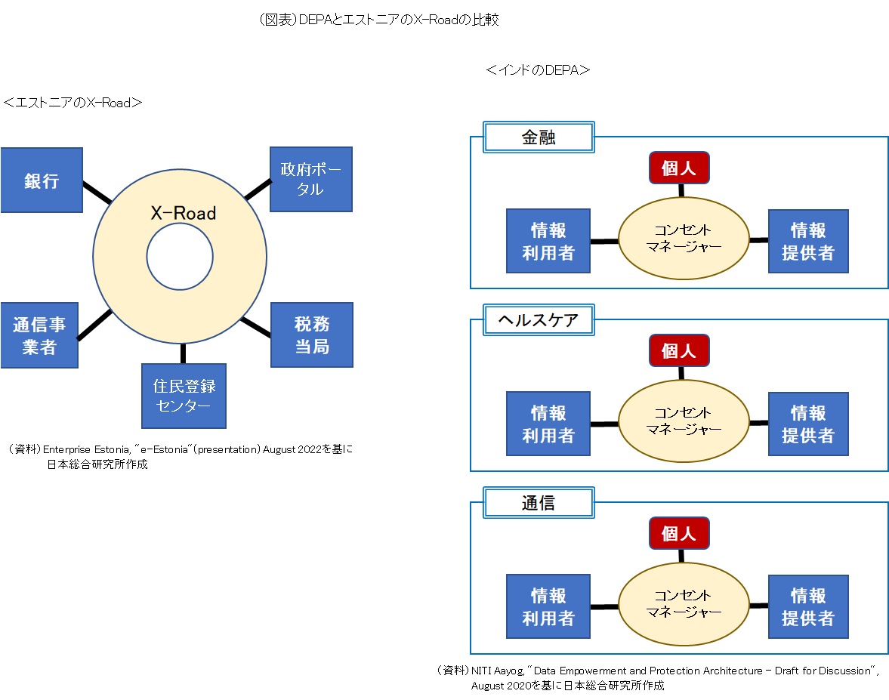

# インドにおける同意に基づく個人データ共有

インド政府が構築した「同意に基づく個人データの共有」とは、ある組織が保有する自身に関するデータについて、①どれを、②誰に、③どのような目的で、④どの期間、共有するかの決定権は個人にあり、共有の見返りとして豊かさや利便性の向上につながるサービスを受けることができる、というものである。実際には、個人が自分で自らデータ共有に乗り出すというよりも、何らかのサービスを申し込んだり受けたりする際に、サービスの提供者が他の組織内にあるその人のデータを使いたいと考え、それにその人が同意する形をとる。
このコンセプトに基づく個人データ共有の流れが図表２である。

個人データの同意・共有を円滑に行う仲介組織として、「コンセントマネージャー」（同意管理者）が設置されている。データを利用したい組織（＝データ利用者）は、そのデータを保有する組織（＝データ提供者）にではなくコンセントマネージャーにその旨を依頼する。依頼を受けたコンセントマネージャーは、個人に対してデータ共有に同意するか否かを尋ね、同意が得られると、データ提供者にデータを求めそれをデータ利用者に渡す。
コンセントマネージャーが置かれることで、データ利用者は一連の作業をワンストップで電子的に行うことができ、自ら個人の同意を取り付けたり、データを取り寄せたりする必要がなく、したがって、そのためのシステムを構築・維持管理する必要がない。
 
コンセントマネージャーを仲介役とした「同意に基づく個人データ共有」は、金融やヘルスケアをはじめさまざまな分野に運用することが想定されている。例えば金融分野で共有されるのは個人の金融資産・負債に関するデータであり、融資できるか、適切な資産運用アドバイスを行えるかといった、資金面にかかわる判断力の向上などを共有の目的とする。それに対して、ヘルスケア分野で共有されるのは個人の健康・医療に関するデータであり、医療の質の改善や医療業務の効率化を共有目的とする。このように、分野ごとにデータ共有の内容や目的が異なる点を踏まえ、基本的な枠組みは維持しつつ、分野ごとに独自の仕組みが構築されることになる。
 
この点が、世界的に有名なエストストニアのデータ共有の仕組みと大きく異なる。エストニアでは、省庁、行政機関、医療機関などが有する個人データの共有が単一の基盤、「X-Road」 を通じて行われる。

しかし、単一の基盤は人口130万人のエストニアでは機能しても、多様性が著しい人口14億人のインドでは機能しづらいとの判断から、インド政府はこれとは異なる独自の仕組みを採用した。
この仕組みの運用第１号として選定されたのが金融分野であり、すでに実装されている。

そして、コンセントマネージャーの役割を果たす組織として、アカウントアグリゲーター（Account Aggregator＜AA＞、直訳すると「取引のとりまとめ者」）が取り入れられた。AAはデータを提供者から利用者に流すだけであり、データの蓄積はおろか、自社での閲覧や加工は一切禁じられている。この点は封書郵便の配達に類似している。郵便ポストに投函された封書が郵便局に一時的に集められた後、宛先に配達されるのと同様に、データも提供者からAAのサーバを経由してそのまま利用者に送られる。郵便職員が封書を開封して中身を読めないのと同様に、流れるデータは暗号化されており、AAは中身をみることができない。
封書郵便と異なるのは、封書の受け取り手はそれを好きなだけ保管出来るのに対して、データ利用者は事前に定められた期間が過ぎると、データを廃棄しなければならない点である。利用者がデータを蓄積したり、当初の目的以外で利用したりすることは禁じられている。
