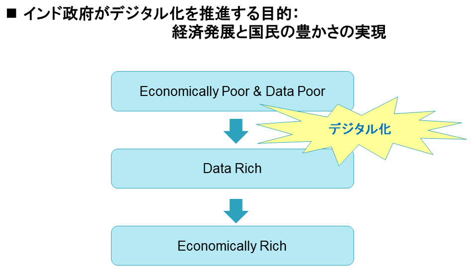
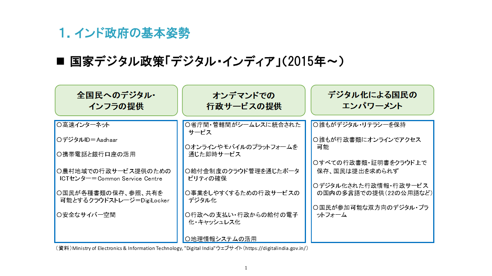
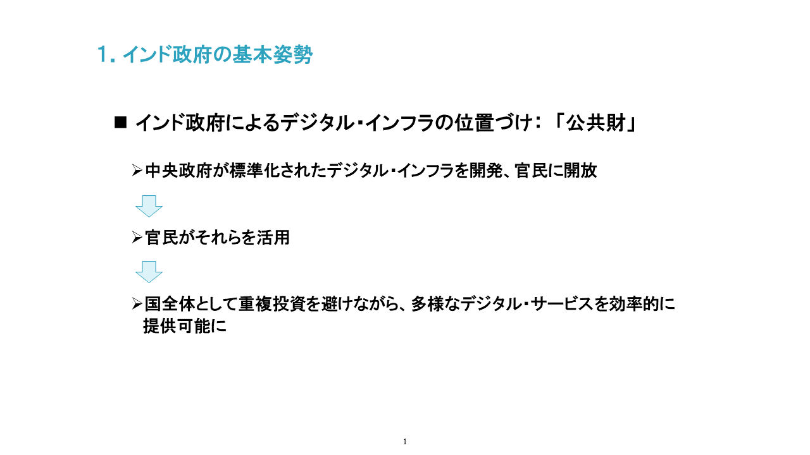
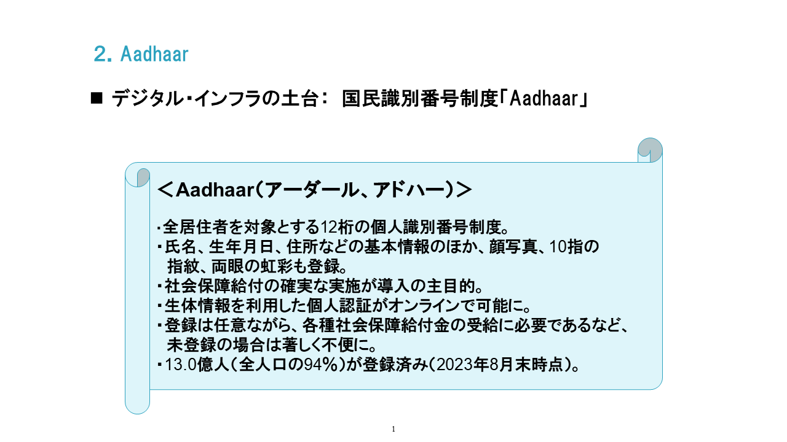
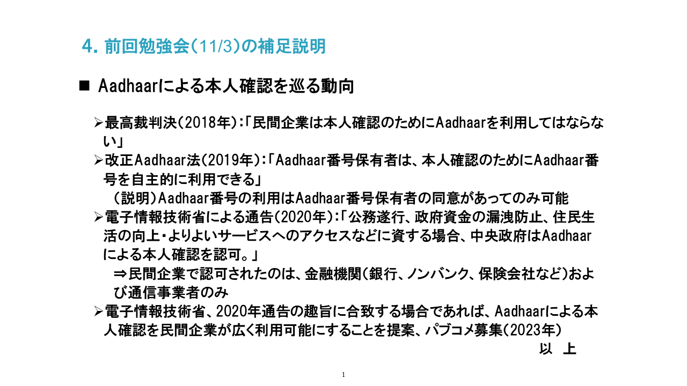

# インド政府の基本姿勢とデジタルIDの取組み		
※この発信は自主勉強会を収録したものである。

## （要約）

## （詳細）

### インド政府の基本姿勢
#### インド政府がデジタル化を推進する目的:経済発展と国民の豊かさの実現

#### 国家デジタル政策「デジタル・インディア」（2015年～）

#### インド政府によるデジタル・インフラの位置づけ: 「公共財」

#### Aadhaar

