# 第3部 インド政府におけるデジタルIDの拡張

##（要約）

##（詳細）
### India Stack
#### 基本コンセプト

#### India Stack開発の中心的担い手

#### India Stack留意点

#### India Stack3つのレイヤー

#### India Stack レイヤーその１：Identity

#### India Stack IndiaStack-レイヤー1Identity図

#### India Stack IndiaStack-レイヤー1Identity-AUA利用機関-Top10

#### India Stack IndiaStack-レイヤー1Identity-eKYC-Top10

#### India Stack レイヤーその２：Payments
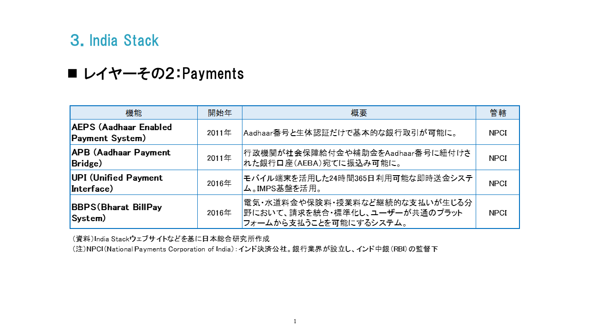

#### India Stack レイヤーその３：Data
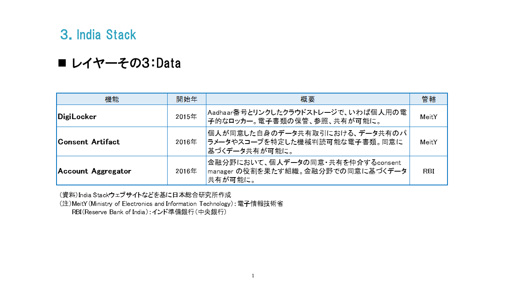

#### India Stack DigiLocker発行書類トップ１０
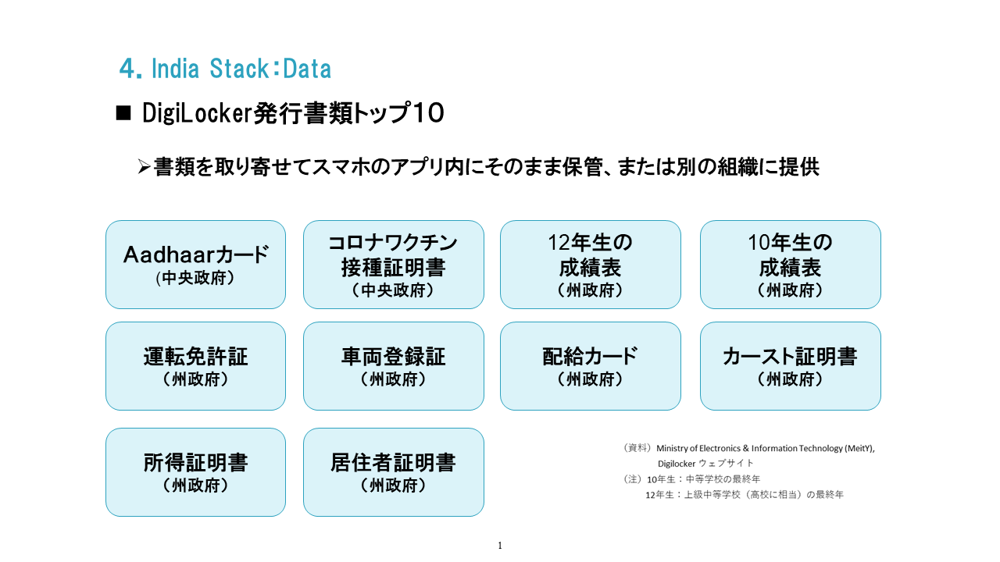

#### India Stack IndiaStack 個人データを本人の同意のもと、プライバシーに配慮しつつ安全に第三者と共有するための基本方針
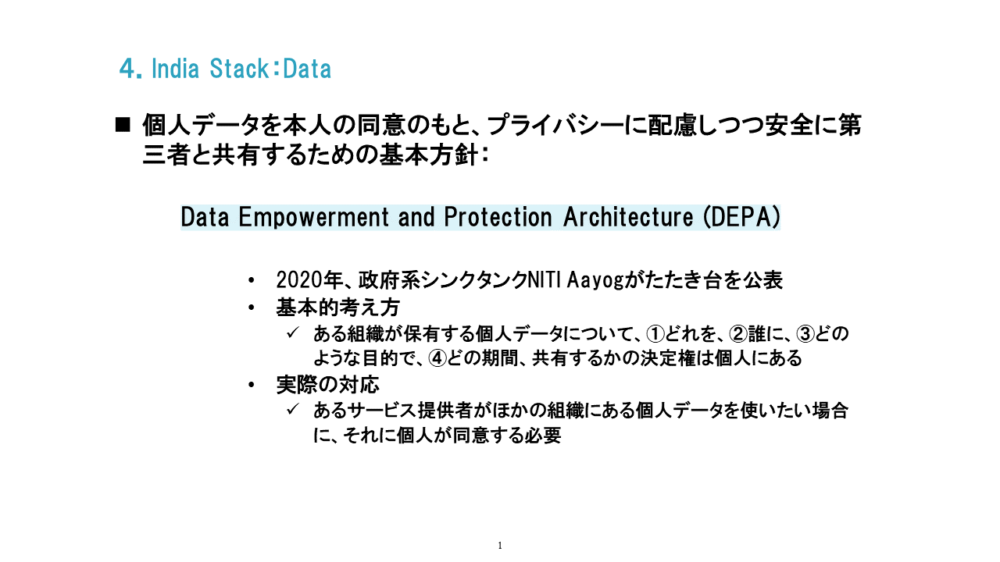

#### IndiaStack-レイヤー3Data-DEPA図（Consent Manager）

#### IndiaStack-レイヤー3Data-AccountAggregatorの活用方法

#### IndiaStack-レイヤーIndiaStack-レイヤー3Data-DEPA分野ごとに運用

#### インドにおけるデジタル公共インフラの範囲
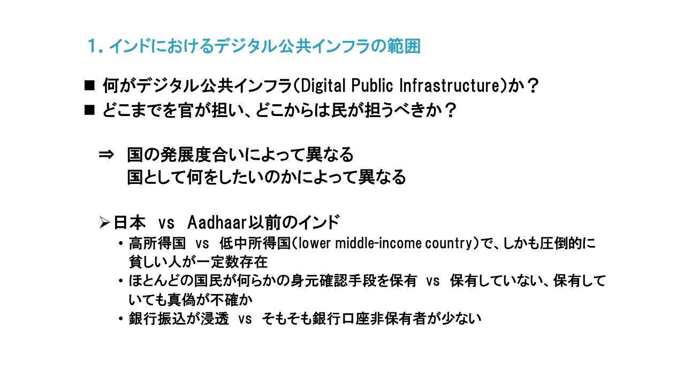

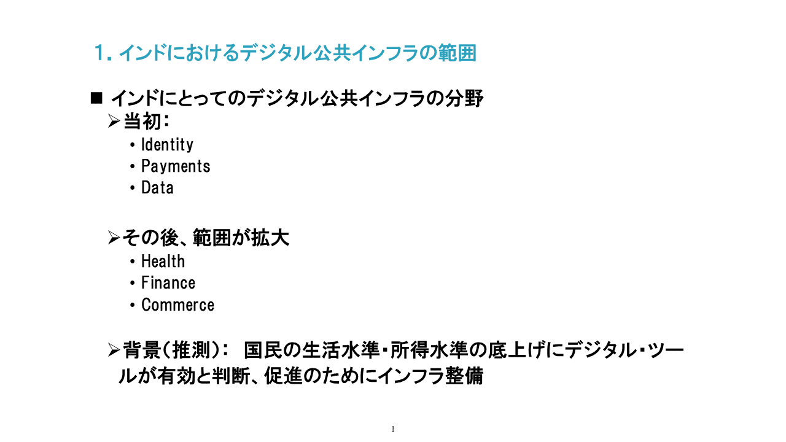

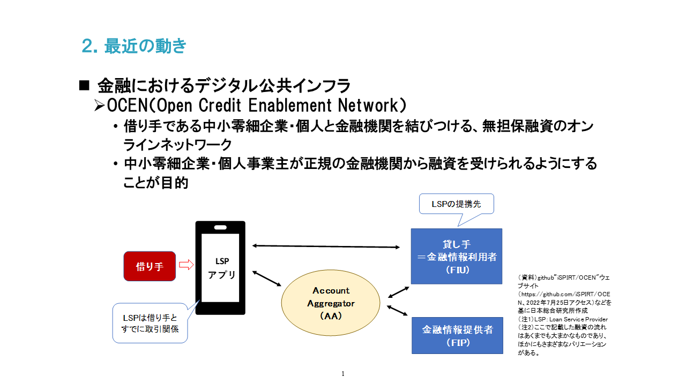

#### IndiaStack-最近の動き
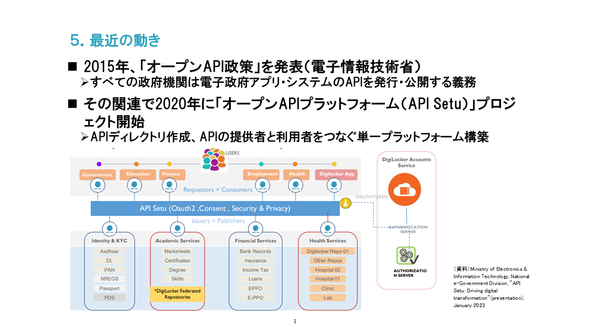

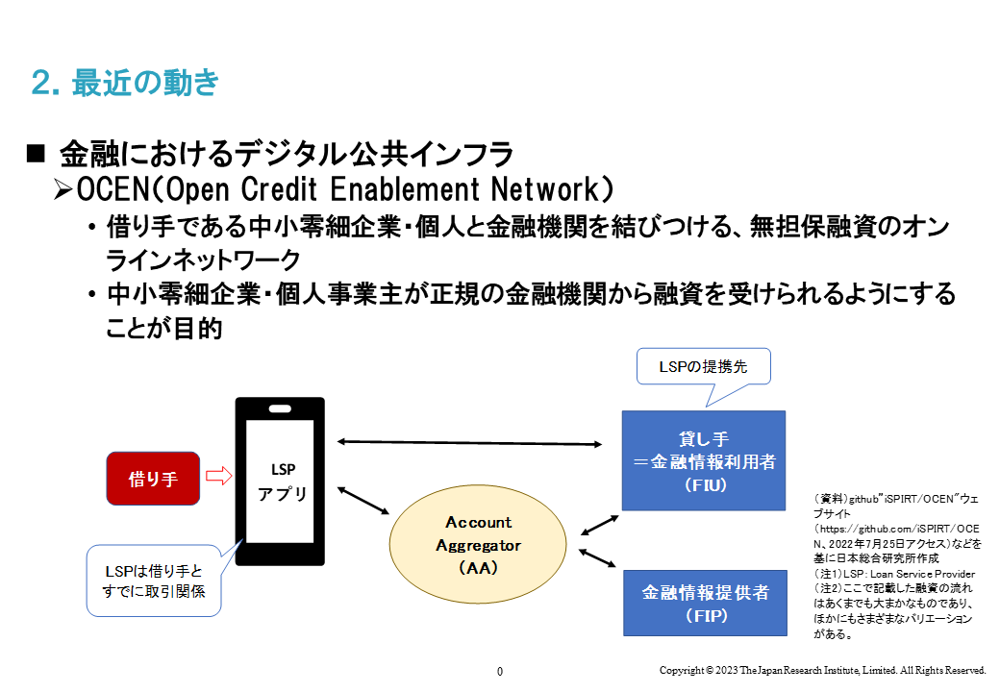

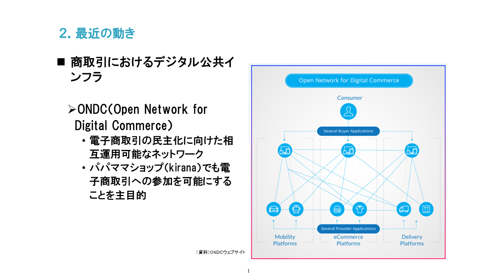

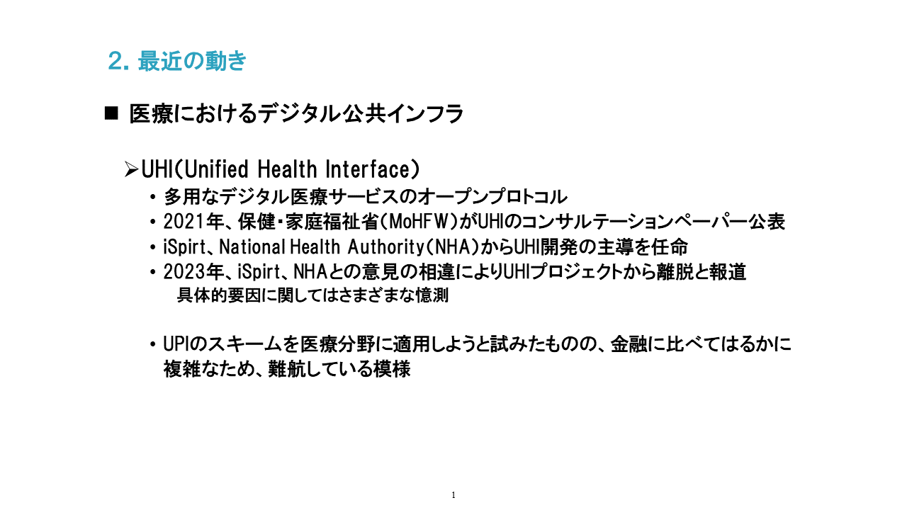
