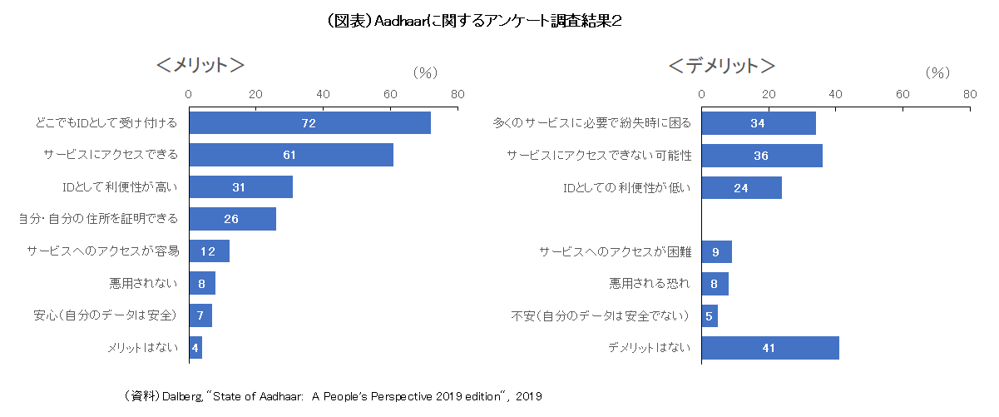

# インドにおける海外展開

インディアスタックの諸機能を一通り構築したインド政府は、現在、これらの海外展開に乗り出している。それによって、インド主導のもと、他の途上国・新興国との間で相互運用性の確立されたデジタル経済圏を確立し、それをテコに発言権を強めるとともに、デジタルの領域における先進国依存から脱却し独立性を強めたいとの狙いがあると推測される。
海外展開は、主に以下の三つのルートを通じて行われている。

## MOSIP（Modular Open Source Identity Platform）の提供

第1に、MOSIP（Modular Open Source Identity Platform）の提供である。MOSIPとは、デジタルIDシステムの円滑な導入を可能にするプラットフォームである。世界の途上国・新興国のなかには、確実な本人確認手段がなく、導入しようにも技術力や資金面での制約から実現できない国が少なからず存在する。そうした国の政府に対して、国際情報技術大学院ベンガルール校（IIITB）が中心となって、インドにおけるAadhaarの導入・普及の経験を活かす形で2018年に開発されたのがMOSIPである。現在、MOSIPのプログラムには10カ国が参加している。

MOSIPのプログラムでは、各国政府に対しデジタルIDのインフラを構築するための技術をオープンソース・ソフトウェアの形で提供するほか、導入のための技術支援や、円滑な運営のための現地職員への訓練を実施している。現在、技術提供は無料、導入支援・訓練は有料で行われている。MOSIPの特徴としては、①モジュラー型の設計となっており、各国政府は諸機能のなかから自国の事情に応じてさまざまに組み合わせて導入することが可能、②オープンソース、オープンスタンダードにより、透明性、柔軟性、相互運用性の面で優れているうえ、導入コストが相対的に安価、③これらの点により、特定のベンダーに依存しないベンダーニュートラルを実現可能、などが挙げられる。

## 「デジタル公共インフラ（Digital Public Infrastructure、DPI）」としてのインディアスタックの共有

第2に、「デジタル公共インフラ（Digital Public Infrastructure、DPI）」としてのインディアスタックの共有である。DPIはさまざまに定義されているが、簡単にいえば、国民生活や経済活動がデジタル技術の恩恵を享受できるように整備された、オンライン上誰もが利用可能なインフラである。デジタル領域でのインフラとして即座に連想するのはインターネットや通信ネットワークであろうが、これらは技術基盤としてDPIとは区別される。技術基盤のうえにDPIが成り立つが、技術基盤にはニュートラルな色彩が濃いのに対して、DPIには、それによって社会・経済を改善したいという明確な期待が込められている。
インド政府はインディアスタックをインドにおけるDPIと位置付け、DPIによってインド国民が享受した恩恵を途上国・新興国にも広げたいとして、その輸出を積極化させている。
2023年のG20議長国であったインドは、デジタル経済大臣会合（2023年8月）やG20首脳会合（同年9月）でDPIの重要性を訴えた。また、G20デジタル経済ワーキンググループのサイドイベントとして「グローバルDPIサミット」を開催し（同年6月）、その場でインディアスタックの共有に向けて4カ国とMOUを締結した。その後、MOU締結国は増え、現在は8カ国となっている（図表８）。DPIとしてのインディアスタックの諸機能のなかでも途上国・新興国がとりわけ強い関心を寄せているといわれるのが、DigiLocker（クラウドストレージ）および後述のUPI（携帯電話を用いた24時間365日即時送金）である。

## UPIのグローバル化 

第3に、UPIのグローバル化である。UPIは世界的にみても先進的な、利便性の高い決済プラットフォームである。QRコードと組み合わせると屋台などリアルな場での支払いにも容易に利用できること、インド政府の指導により利用者側、店舗側とも手数料が基本的に無料となっていること、などにより、2016年にインドで導入されて以降、利用が爆発的に増加した。インド国内においてリテール電子決済件数全体に占めるUPIの割合はいまや74％に達する（2022年度）。
2点目のDPIのスキームでは、インディアスタックの一つの機能としてUPIを他国に導入するというものであるが、この3点目ではそれとは別に、UPIの他国での利用、および他国の即時送金システムとのリンクに取り組んでいる。前者の、UPIの他国利用については、ブータン（2021年7月）を皮切りに、現在はシンガポール、UAE、モーリシャス、ネパールでも可能となっている。例えば、インドからブータンへの渡航者は、ブータンの店舗にあるQRコードに携帯電話をかざして支払いができる。後者の他国の即時送金システムとのリンクについては、2023年2月にシンガポールのPayNowとの間で実現した。インドからシンガポールの渡航者ばかりでなく、シンガポールからインドへの渡航者も、店舗でのQRコード決済が可能になった。こうしたリンクが拡大すると、越境決済の姿も大きく変わることになろう。

- Aadhaar利用状況と国民のフィードバック

アドハーの登録間違いもまだ散見される。以下の調査結果からは、2010年から9年間取り組んできた状況が見られる。

