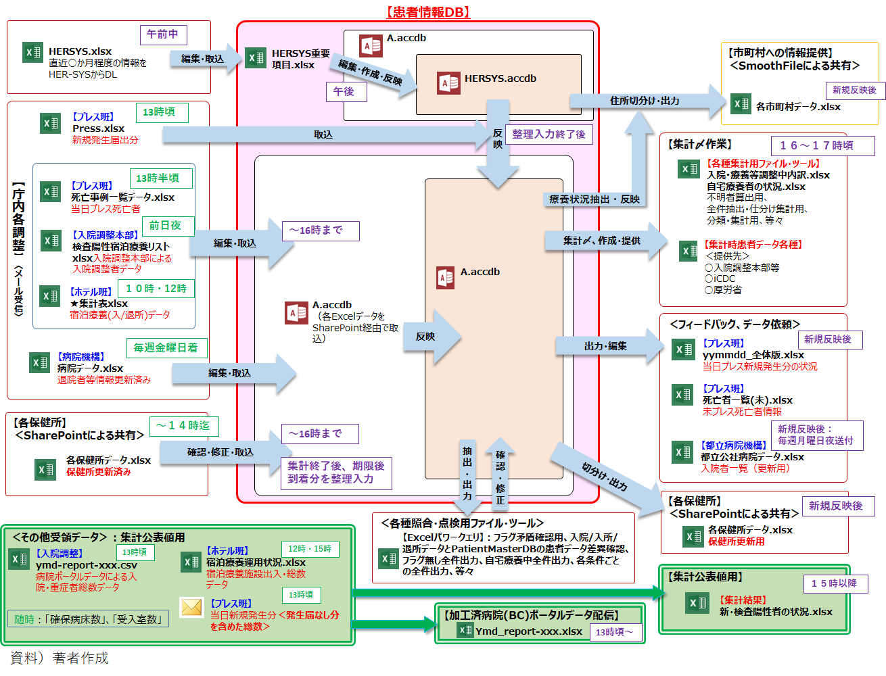
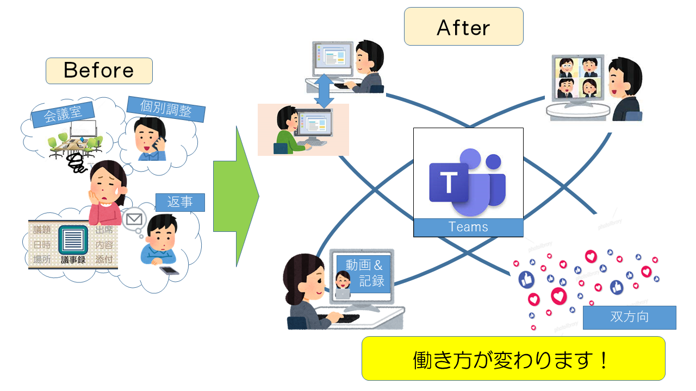
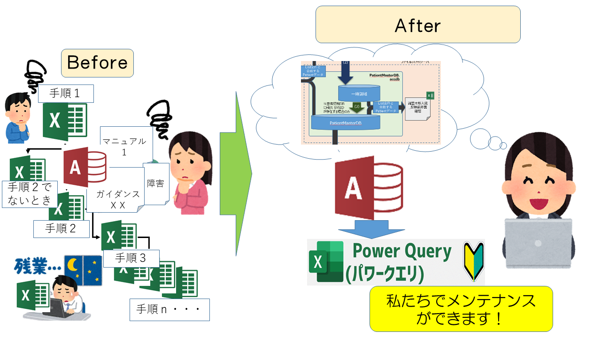
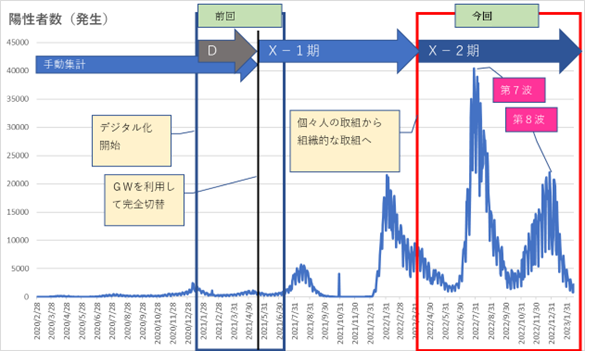

# 事例１　コロナ禍での患者情報一元管理
※なお、この発信は個人の意見であり実在する団体とは関係ありません。

<B>広域におけるデータ一元化の取組</B>

厚生労働省からの情報を広域で一元管理を行い、基礎自治体へ必要な情報を連携、罹患したコロナ患者を自宅療養者含め共助としてサポートを行うことで行政間で命を救うバトンを実現した。

## D（Dital）の取組み
### 概要
福祉保健局保健所連携支援担当チームは、昨年より広域下約40ブロックの保健所・医療機関が入力するHERSYS情報・Press情報を受付て、日々広域自治体におけるコロナ陽性者の療養状況等のデータを一元管理していた。その管理業務は、休祭日も休みなく療養状況その他の患者情報を遅滞なく更新するというものであった。
　昨年から負担も大きかったことに加え、今年4月には８割の人員異動がありました。その運用トランスファー等が必要な状況の中さらに増加するデータに対応するためGW期間を使って職員だけでExcelからAccessへのシステム切り替えが行われました。
　これは、限られたリソースの中で関係職員全員がDXに取り組み難局を乗り越えた状況である。

### その１：会議は密を避けオンライン実施！
これまで対面でしていた委託業者や庁内の打合せをオンラインで行っていた。打合せ中はeamsで画面を共有することもでき、離れていても何の不便もなく実施が行えた。
　また、システム関係で操作に不安があったり不具合が生じた際にも、Teamsの画面共有で状況をお伝えしたり、操作の指示をいただくこともできたため、とても助かった。

### その２：Excel－PowerQueryのオンライン勉強会
最初は作っていただいたものを使うだけでしたが、オンライン勉強会のおかげで、簡単な内容であれば、担当職員でもPowerQueryを作成できるようになった。初めてPowerQueryを使う職員ばかりでしたが、基礎的な内容から作成方法まで分かりやすく教えていただき、本当に感謝している。日々の業務で頻繁に使用しているデータを使って教えていただけたので、勉強会の直後から各職員のアイディアで業務の効率化が図られ、とても役立っている。

### その３：Teamsに動画保存　⇒　復習、会議不在者とスムーズに情報共有
Teamsに打合せ内容やオンライン勉強会の動画を掲載することで、不在時のキャッチアップや勉強会の内容を思い出したいときに、簡単かつ正確に内容を共有し、復習することができた。議事録の作成や説明の手間も省け、何より分かりやすいと担当内で好評で、いいことづくめである。

## X（transformation）の取組み
基礎自治体からPIAを取得、データ連携により基礎自治体から自宅療養者への定期的な連絡を実現した。
蓄積データは100万件を超えたが、限られた人的リソースの中で、第7波、第8波も運用を乗り越えることができた。

## （次世代への提言）DEPA方式の際に考慮すべき点と役割
次世代のDEPA方式においては、以下を実現することにより、行政関係者は本当に助けを必要とする市民に集中して迅速な対応を取ることができる。

### 国の役割
- 国は、Identityとそれを特定するData、および、それを抽出する仕組み（API）を提供する。
### 広域の役割
- 広域自治体は、地域特性に応じた流動的なDataを管理、周辺のAPI等を実装する。
### 市民の役割
- 上記以外を国、広域に求めると本当に実現したい管理が薄まる、または、地域や期間特定のガラバゴス化対応となる懸念がある。このため、DXの第1優先は実現可能な必要最低限までのサービスとして過剰なサービス要求は行わない。
- 広域を支えること。

