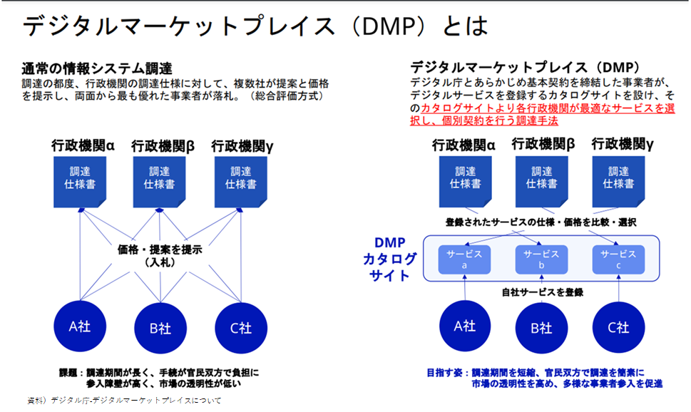

# 事例２ ハッカソン等を通した官民共創の取組み
※なお、この発信は個人の意見であり実在する団体とは関係ありません。

## なぜ、ハッカソンなのか？
内製では時間がかかる。サービス実装化を検討したいがプロトタイプを知りたい、導入における運用上の課題の洗い出しをおこないたい、このように時間、最新技術の取組でできることを知りたいときにハッカソン開催は便利です。また、技術に関わらず組織の壁を越えて実現可能か検証したいときにも実施することができます。

## 行政課題とハッカソンを活用した官民の取組
行政の中で3年間、ハッカソン（都知事杯、OSS、デジタル庁）に関わり、パターン化が見えてきました。
この流れは、行政にジャストフィットします。現在のような技術の進化が激しい（クラウド／セキュリティ／AI）時代には、社会実装および導入に結び付く確率が高いようです。OSSだとさらに親和性が高いです。スタートアップも同様のようです。

### ステップ
- 1.社会、行政課題発掘
- 2.行政とのマッチング
- 3.PoC　　　　　　　←②
- 4.行政から発表
- 5.行政側の企画、予算準備等
- 6.本格運用に向けてマッチング
- 7.本番開発・導入 　←①、④
- 8.運用　　　　　　 ←③

### 具体的な取組み

①OpenData Bridge（北九州市96万人実証　／　スピンオフしたチームがデジタル庁案件を受注）

②マイナセーフティ（デジタル庁マイナポータルハッカソン）

③八王子市OSSハザードマップ　※約60万人向けサービス
https://www.city.hachioji.tokyo.jp/tantoumadoguchi/004/003/p031953.html

④奥多摩村モンキーハンター（東京都OSSパーティ）

### サービス導入に向けての行政の取組み
行政も良質なサービスは、知りたいと考えています。全国どの自治体も取組みが知れるよう、比較検討ができるよう、調達ができるようデジタルマーケットプレイス（DMP）の整備、推進を行っています。

## 提言
市民や子ども目線で考えた場合、このような仕組みが考えられないか、他国で実現できているもので我が国でも実現ができないかをハッカソンを通じて実施してみることができます。