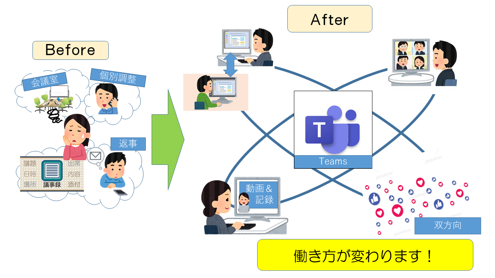
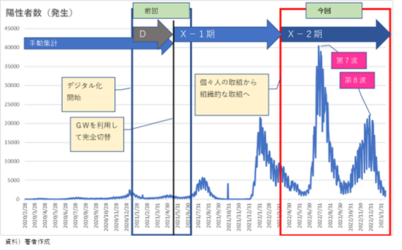

# 日本の国・広域行政における取組事例

## 事例（広域）　コロナ禍での患者情報一元管理

※なお、この発信は個人の意見であり実在する団体とは関係ありません。

### （要約）

- <B>データ連携の重要性と実装を"現場"で"現物"を示し"現実"に運用の具現化までを実現</B>
- <B>デジタルでラストワンマイルまで届く仕組みを実現</B>

### （詳細）

<B>広域におけるデータ一元化の取組</B>

厚生労働省から届く陽性者情報を広域側で一元管理を行った。管理対象は、新規発生の他、保健所・病院・宿泊施設から届く宿泊・療養・死亡等の更新情報である。日々、基礎自治体へ最新情報を連携することで、罹患したコロナ患者を自宅療養者含めて共助としてサポートを行う行政間連携を実現した。

#### D（Digital）の取組み

- 概要

保健所連携支援担当チームは、2020年より広域下約40ブロックの保健所・医療機関が入力するHERSYS情報・Press情報を受付て、日々広域自治体におけるコロナ陽性者の療養状況等のデータを一元管理していた。その管理業務は、休祭日も休みなく療養状況その他の患者情報を遅滞なく更新するというものであった。
 
2020年から負担も大きかったことに加え、2021年4月には8割の人員異動があった。その運用トランスファー等が必要な状況の中さらに増加するデータに対応するためGW期間を使って職員だけでExcelからAccessへのシステム切り替えが行われた。
　これは、限られたリソースの中で関係職員全員がDXに取り組み難局を乗り越えた記録である。

- 会議は密を避けオンライン実施！

これまで対面でしていた委託業者や庁内の打合せをオンラインで行っていた。打合せ中はTeamsで画面を共有することもでき、離れていても何の不便もなく実施が行えた。
 
また、システム関係で操作に不安があったり不具合が生じた際にも、Teamsの画面共有で状況をお伝えしたり、操作の指示をいただくこともできたため誰もが迅速に運用を行うことができた。

- Excel－PowerQueryのオンライン勉強会
最初は作っていただいたものを使うだけでしたが、オンライン勉強会のおかげで、簡単な内容であれば、担当職員でもPowerQueryを作成できるようになった。初めてPowerQueryを使う職員ばかりだったが、基礎的な内容から作成方法まで分かりやすく教えていただき、本当に感謝している。日々の業務で頻繁に使用しているデータを使って教えていただけたので、勉強会の直後から各職員のアイディアで業務の効率化が図られ、とても役立っている。

- Teamsに動画保存　⇒　復習、会議不在者とスムーズに情報共有

Teamsに打合せ内容やオンライン勉強会の動画を掲載することで、不在時のキャッチアップや勉強会の内容を思い出したいときに、簡単かつ正確に内容を共有し、復習することができた。議事録の作成や説明の手間も省け、何より分かりやすいと担当内で好評でいいことづくめであった。

#### X（transformation）の取組み

こちらは、実際の管理風景（イラスト）である。内製化を支えたメンバーは、一般職員であった。

基礎自治体から特定個人情報保護評価(PIA)を取得、広域から基礎自治体へデータ連携を行うことにより、基礎自治体から自宅療養者への定期的な連絡を実現した。
 
陽性者の蓄積データは累積で100万件を超えたが、早い段階でデジタル化を進めたこと、局内教育を含めた内製化に取り組んだおかげで、第7波、第8波も運用を乗り越えることができた。

### （次世代への提言）

次世代の同意に基づく個人データの共有方式においては、以下を実現することにより、行政関係者は本当に助けを必要とする市民に集中、迅速な対応を行うことができる。

- 国の役割
  - 国は、Identityとそれを特定するData、および、それを抽出する仕組み（API）を提供する。
- 広域の役割
  - 広域自治体は、地域特性に応じた流動的なDataを管理、周辺のAPI等を実装する。
- 市民、他行政の役割
  - 国・広域の方針や取組みを理解し、自分達が取り組めること、できることに参加したり、進めてくれている方々を応援する。当事者として一過性の要求を行う場合は、本当に実現したい管理が薄まらないか、または、地域や期間特定のガラバゴス化対応とならないかの観点があることを踏まえてよく対話をする。
  - 当事者として参加する場合は、ラストワンマイルまで届くサービス実現を全員で考える。
  - 第三者の場合は、スキルを持つ方に任せるならば委任し、当事者が業務に集中できる環境提供に努める。
  - 行政関係者は、それぞれの役割を理解し国・広域を支える。  
