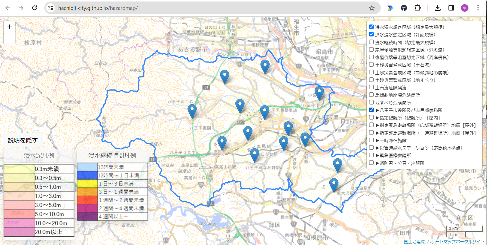
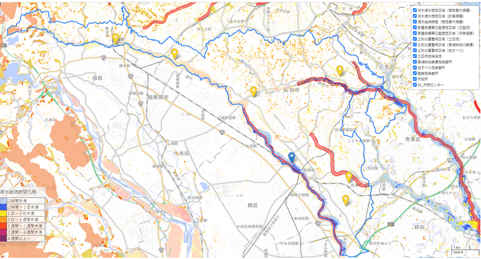
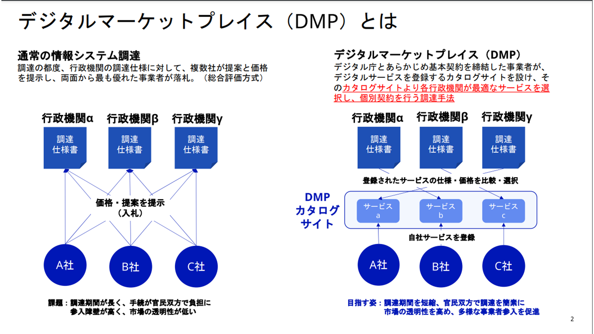
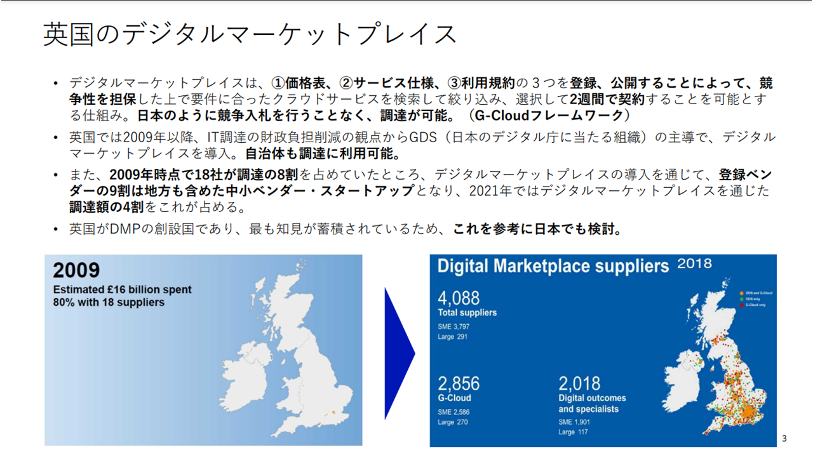
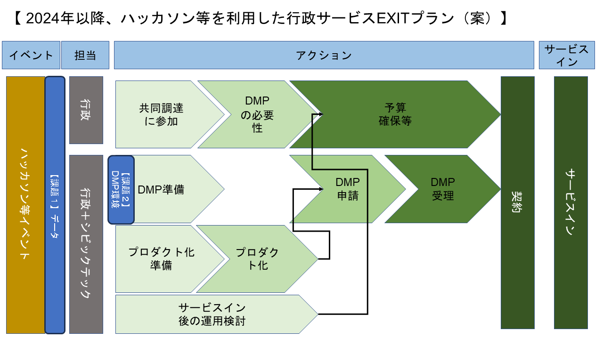

## 事例（広域） ハッカソン等を通した官民共創の取組み

※なお、この発信は個人の意見であり実在する団体とは関係ありません。

### （要約）

- <B>次世代の行政サービスについて、社会実装のイメージを関係者間で共有ができないだろうか。</B>
- <B>社会実装の際の課題、実現可能に必要なステップをより深ぼって共有ができないだろうか。</B>
- <B>苦労して生み出した製品、行政とマッチングしたサービスは、もっとシンプルに期間短縮で社会実装はできないだろうか。</B>

### （詳細）

#### なぜ、ハッカソンなのか？

皆さんの周りにはこのような方はいらっしゃらないでしょうか。

- 民間の皆さんや学生の皆さんの中で、少しでも社会課題解決に貢献したい
- 自分が持つ専門知識で社会に貢献したい

行政サービスの内製は時間がかかる。
サービス実装化を検討したいがプロトタイプを知りたい、導入における運用上の課題の洗い出しをおこないたい行政や同様の課題を持つ市民の方とその解決に力を貸したい、一緒に取り組みたい、その両者を繋げるのが、ハッカソンになる。
また、最新技術の取組や検証で何ができるだろうかを知りたいときにハッカソン開催は便利である。
社会課題は、技術に関わらず、団体・組織の壁を越えて実現可能かを検証したいときにも役立つ。

#### （準備）OSS公開ガイドラインを整備

2021年コロナ禍での感染症対策の経験を踏まえつつ、OSS化がもたらす社会的効果を
- 行政が保有する知的資産（ソースコード）を公共財として、市民や他の自治体と共有することで、国内外から幅広く意見（修正改善意見）を聞くことが可能となり、これによりOSS自体が自律的に発展し、都民にその利益を還元することが可能となる。
- この動きを全国に波及させることで、行政などが類似するシステムを構築する際の開発時間とコストの縮減にも寄与することができる。

と捉え、その効果を最大限に活かし、行政のQOS（クオリティ・オブ・サービス）の向上を推進していくため、このガイドラインを策定し、行政全体でOSSに取り組んでいくために策定された。
オープンソースソフトウェア（略称: OSS）は、「ソフトウェアのソースコードが一般に公開され、商用、非商用の目的を問わずソースコードを使用、調査、再利用、修正、拡張、再配布が可能なソフトウェアの総称」をいう。OSSは、広く一般に公開され、誰しもが使えるため、使おうと思った人や、貢献意識の高い有志の人が、使うときなどにソースコードのバグを探して修正したり、さらには、より良いものに改良してくれるなどのメリットがある。このメリットを活用するために、積極的に取り組んでいるアメリカでは、2016年11月3日に”The People’s Code”という声明を発表し、Code.govを立上げ、オープンソースプロジェクトを推進している。
このガイドラインでは、OSSの定義や公開から廃棄までの手順、注意点などを明記されている。

#### （実行）公開イベントと推進活動の開催

東京都OSSガイドラインの公開イベントが行い、それを皮切りに、行政と市民エンジニアとの共創を推進し行政のOSS活用を後押しする「Tokyo OSS Party!!」が開催された。

本イベントは行政としては例を見ない初めての試みでしたが、36名もの方にご参加いただき、10チームがオープンソース化を目指してプロダクト（アプリケーション）開発にトライした。イベント終了後も、slack上では参加者と行政との間で活発に意見交換が行われていた。
Tokyo OSS Party!!のイベントは実施することが「ゴール」ではなく、今後の行政のOSS活用を検討するための、そして市民エンジニアと行政との新しい共創の形を探る「スタートライン」として、その機能を果たしたものであり、ともに考えともに作るシビックテックの存在が行政職員に認識されたタイミングでもあった。

#### （実装と普及）行政での本格実装と職員による勉強会

行政組織としてGithubアカウントを取得し、2022年、実際に行政で採用された携帯で参照ができる防災マップは以下になる。主に国のオープンデータとして提供されている情報は表示はされる。なお、地域が管理する内水情報は含まれていない。

行政で本格運用後、この取組みを推進しDXを経験した行政職員からまだDXを一度も経験していない職員に対して行政課題対応・ハンズオン研修が行われた。その際、参加者全員が住まいの自治体の防災マップを作成した。

#### （普及の拍車と社会課題に取組むコミュニティ形成と拡大）

更に翌年度は、5地域からの課題に合わせて、他自治体職員も参加し2件のサービス導入が行われた。
そこで形成されたOSSによる社会課題解決コミュニティは、現在も拡大しており、他のハッカソン参加も行われている。そこで作られた作品は省庁案件に採用されたもの、スタートアップと共に作成しているもの、コミュニティ活動を経験して省庁職員になった方も数名いる。

#### 行政課題とハッカソンを活用した官民の取組

行政の中で3年間、ハッカソン（都知事杯、OSSパーティ、デジタル庁）に関わり、この活動のパターン化と取組みからの付帯効果が大きいことが分かってきた。
この流れは、行政にジャストフィットする。現在のような技術の進化が激しい（クラウド／セキュリティ／AI）時代には、社会実装および導入に結び付く確率が高い。OSSだとさらに親和性が高くなる。スタートアップもスモールスタートからの流れは同様である。（今回は、説明を補記できていないが、インドでもハッカソンは国のサービスレベルで活用されている。）

- ステップ
  - 1.社会、行政課題発掘
  - 2.行政とのマッチング
  - 3.PoC　　　　　　　←②
  - 4.行政から発表
  - 5.行政側の企画、予算準備等
  - 6.本格運用に向けてマッチング
  - 7.本番開発・導入 　←①、④
  - 8.運用　　　　　　 ←③

- 具体的な取組み

  - ①OpenData Bridge（K市96万人実証　／　スピンオフしたチームが省庁案件を受注）

  - ②マイナセーフティ（デジタル庁マイナポータルハッカソン）

  - ③八王子市OSSハザードマップ　※約60万人向けサービス
    ・国等と最新データと連携、スマートフォンに表示可能なハザードマップ

https://hachioji-city.github.io/hazardmap/

  - ④奥多摩村モンキーハンター（東京都OSSパーティ）

- 社会実装およびサービス導入に向けての行政の取組み
行政も良質なサービスは、知りたいと考えている。全国どの自治体も取組みが知れるよう、比較検討ができるよう、調達ができるようデジタルマーケットプレイス（DMP）の整備、推進が行われている。

今後は、それぞれの団体で開催されていたハッカソンもDMPを活用することにより広範囲に展開ができる社会実装のEXITプランが考えられる。

または、DMPは、先行自治体の調達時間が短縮されることにより、自治体全体としても調達のサイクルが早くなることが予想される。

### （提言）

今までは、開催する団体だけで実現可能なアイデアや企画の共有だったように見受けられる。

今後は、市民や子ども目線で考えた場合、以下のようなことを幅広く実施することはできないか。

- 国や広域が直面している社会課題に対して、連携してハッカソンのような試行取組みが考えられないだろうか。
- 他国で実現ができた国家や広域での取組みも試行的に行政の垣根を越えて取組みができないだろうか。

（余談）
もし、DMPか関連サービスで、同じ財政規模、人口規模の自治体が導入している行政サービス別にAmazonの星やリコメンド等があれば、その情報より自治体の調達負担の軽減が見込めることが考えられる。