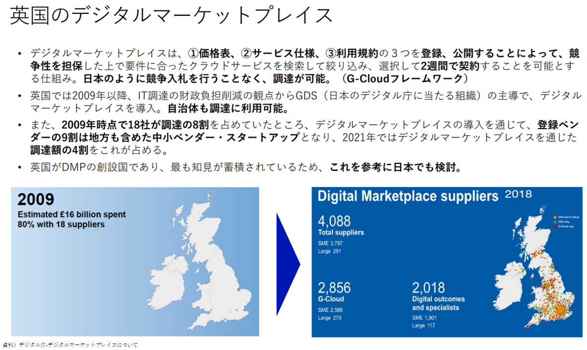
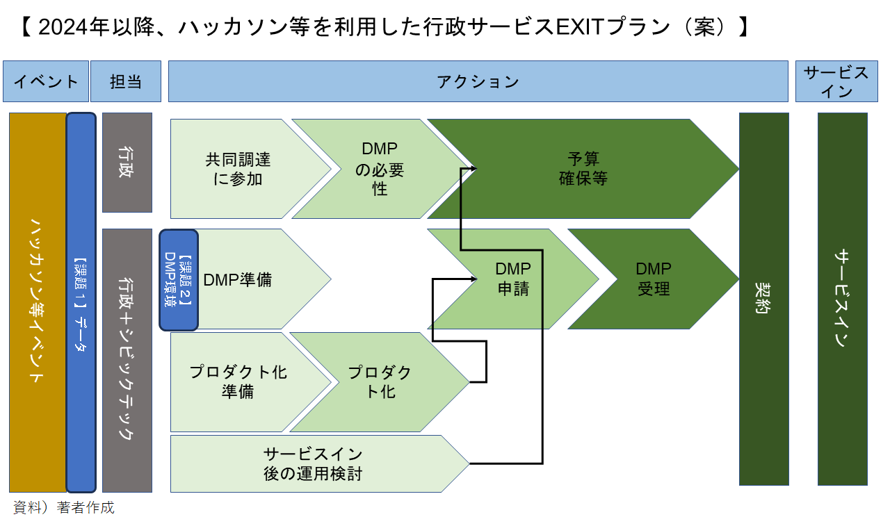

## 事例（広域） ハッカソン等を通した官民共創の取組み

※なお、この発信は個人の意見であり実在する団体とは関係ありません。

### （要約）

- <B>次世代の行政サービスについて、社会実装のイメージを関係者間で共有ができないだろうか。</B>
- <B>社会実装の際の課題、実現可能に必要なステップをより深ぼって共有ができないだろうか。</B>
- <B>苦労して生み出した製品、行政とマッチングしたサービスは、もっとシンプルに期間短縮で社会実装はできないだろうか。</B>

### （詳細）

#### なぜ、ハッカソンなのか？

皆さんの回りにはこのような方はいらっしゃらないでしょうか。

- 民間の皆さんや学生の皆さんの中で、少しでも社会課題解決に貢献したい
- 自分が持つ専門知識で社会に貢献したい

行政サービスの内製は時間がかかります。
サービス実装化を検討したいがプロトタイプを知りたい、導入における運用上の課題の洗い出しをおこないたい行政や同様の課題を持つ市民の方とその解決に力を貸したい、一緒に取り組みたい、その両者を繋げるのが、ハッカソンになります。
また、最新技術の取組や検証で何ができるだろうかを知りたいときにハッカソン開催は便利です。
社会課題は、技術に関わらず、団体・組織の壁を越えて実現可能かを検証したいときにも役立ちます。

#### 行政課題とハッカソンを活用した官民の取組

行政の中で3年間、ハッカソン（都知事杯、OSS、デジタル庁）に関わり、パターン化が見えてきました。
この流れは、行政にジャストフィットします。現在のような技術の進化が激しい（クラウド／セキュリティ／AI）時代には、社会実装および導入に結び付く確率が高いようです。OSSだとさらに親和性が高いです。スタートアップも同様のようです。

- ステップ
  - 1.社会、行政課題発掘
  - 2.行政とのマッチング
  - 3.PoC　　　　　　　←②
  - 4.行政から発表
  - 5.行政側の企画、予算準備等
  - 6.本格運用に向けてマッチング
  - 7.本番開発・導入 　←①、④
  - 8.運用　　　　　　 ←③

- 具体的な取組み

  - ①OpenData Bridge（K市96万人実証　／　スピンオフしたチームが省庁案件を受注）

  - ②マイナセーフティ（デジタル庁マイナポータルハッカソン）

  - ③八王子市OSSハザードマップ　※約60万人向けサービス
https://www.city.hachioji.tokyo.jp/tantoumadoguchi/004/003/p031953.html

  - ④奥多摩村モンキーハンター（東京都OSSパーティ）

- 社会実装およびサービス導入に向けての行政の取組み
行政も良質なサービスは、知りたいと考えています。全国どの自治体も取組みが知れるよう、比較検討ができるよう、調達ができるようデジタルマーケットプレイス（DMP）の整備、推進が行われています。

今後は、それぞれの団体で開催されていたハッカソンもDMPを活用することにより広範囲に展開ができる社会実装のEXITプランが考えられます。

または、DMPは、先行自治体の調達時間が短縮されることにより、自治体全体としても調達のサイクルが早くなることが予想されます。

### （提言）

今までは、開催する団体だけで実現可能なアイデアや企画だったように見受けられます。

今後は、市民や子ども目線で考えた場合、以下のようなことを幅広く実施することはできないかと考えています。

- まさに目の前に直面する社会課題に対して、このような仕組みが考えられないだろうか。
- 他国で実現できている。我が国でも実現ができないだろうか。

もし、DMP側で、同じ財政規模、人口規模の自治体が導入しているサービス別にAmazonの星やリコメンド等があれば、その情報より、自治体の調達負担の軽減が見込めるかなと感じます。