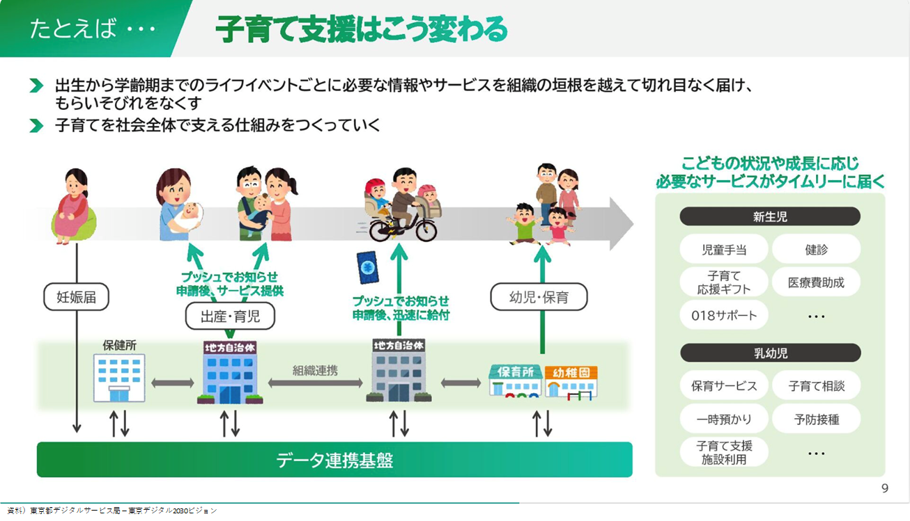

## 事例（国・広域） 子どもDXの推進

※なお、この発信は個人の意見であり団体とは関係ありません。

### （要約）

- <B>市民が出生から学齢期までのライフイベントごとに必要な情報やサービスを享受できる</B>
- <B>子育てを社会全体で支える仕組みをつくっていく</B>
- 

### （詳細）

#### 要求事項

##### 概要

- 子育て関連の手続きにおける情報の把握や申請が大きな負担となっている。
- 保育の現場では、報告書作成など、紙ベースの業務が課題となっている。
- 複雑化する子育て相談により、職員の事務負荷が増加している。
- 子育て関連の手続きが複雑で、自治体によって制度や申請方法が異なることが問題視されている。
- デジタル化を活用し、子育て世帯や保育・相談の現場の負担を軽減し、子どもへの支援環境を整える必要がある。

##### 子育て世帯からの声

- 「手続が複雑」
- 「妊娠から出産後２ヶ月までに妊娠・出産・保育園の手続のために90枚以上の紙を受け取り、７回役所に行く必要があった」
- 「制度や申請方法が自治体毎にバラバラで探しにくい」

##### プッシュ型子育て支援の実現

- １）必要な情報を最適に届ける仕組みの構築
  - 子育て支援制度や申請方法が複雑で、自治体ごとに異なるため、情報の把握が負担となっている。
  - 2024年度に子育て支援制度の全国調査を実施し、「子育て支援制度レジストリ」を作成する予定。
  - レジストリ情報をオープンデータ化し、子育てアプリと連携させることで、必要な情報をスマートに配信する仕組みを2025年度以降に実現する。
  - この仕組みにより、子育て世帯が情報把握する時間を削減し、手続きの忘れを防止し、子育て支援制度の利用率向上を目指す。

- ２）出生届のオンライン化
  - 出生届の対面提出や紙媒体使用が子育て世帯の負担になっている。
  - 出生届のオンライン化を推進し、全自治体で可能となるように、マイナポータルを介したオンライン届出を2026年度に実現する予定。
  - 出生証明書についても、医療機関から自治体への直接提出を可能とするための検討を進める。
  - その間、オンラインでの出生届出における出生証明書の添付について、医師の電子署名の必要を省く省令改正を実施。
  - 2024年夏までに、希望する市区町村で、その画像情報による添付が可能となるマイナポータルを用いたオンライン出生届出を実現する予定。

- ３）母子保健DXの推進
  - 現在、妊婦や乳幼児の健診は紙媒体が基本で、住民、自治体、医療機関に負担がかかっている。
  - 健診結果の共有にタイムラグが生じている。
  - PMHや電子版母子健康手帳を活用してスマートフォンで健診受診や結果確認を可能にし、住民の利便性を向上させ、自治体や医療機関の負担を軽減する。
  - 2023年度に母子保健情報を共有・活用する情報連携基盤（PMH）を整備する。
  - 2024年度に課題と対応を整理、2025年度にガイドラインを発出し、2026年度以降の普及（全国展開）を目指す。

- ４）里帰りする妊産婦への支援
    - 里帰りをする妊産婦の健診情報や伴走型相談支援の情報が自治体間で十分に共有できておらず、続けての支援や手続きが困難になっている。
    - 2023年度に里帰りに関する実態調査を行い、2024年度以降早期に、情報共有のための制度改正を実施する予定。
    - 2024年度には、情報連携基盤(PMH)を活用した里帰り妊産婦に関する母子保健情報の自治体間連携システムを作る予定で、2026年度以降には全国展開を行う計画。
    - これにより、里帰り先の自治体と本籍地の自治体で母子保健情報がスムーズに共有され、切れ目ない支援が可能になり、さらに、手続きの改善にもつながる。

### （提言）

子どもDX推進は、生まれたばかりである。次世代の同意に基づく個人データの共有方式においては、以下を実現することにより、日本全国いつでもどこでも誰とでも繋がる行政サービスを構築し、実運用までつながることができる。

#### 国の役割

- 国は、Identityとそれを特定するData、および、それを抽出する仕組み（API）を提供する。

#### 広域の役割

- 広域自治体は、地域特性に応じた流動的なDataを管理、周辺のAPI等を実装する。

#### 市民、他行政の役割

 - 国・広域の方針や取組みを理解し、自分達が取り組めること、できることに参加したり、進めてくれている方々を応援する。当事者として一過性の要求を行う場合は、本当に実現したい管理が薄まらないか、または、地域や期間特定のガラバゴス化対応とならないかの観点があることを踏まえてよく対話をする。
  - 当事者として参加する場合は、ラストワンマイルまで届くサービス実現を全員で考える。
  - 第三者の場合は、スキルを持つ方に任せるならば委任し、当事者が業務に集中できる環境提供に努める。
  - 行政関係者は、それぞれの役割を理解し国・広域を支える。
